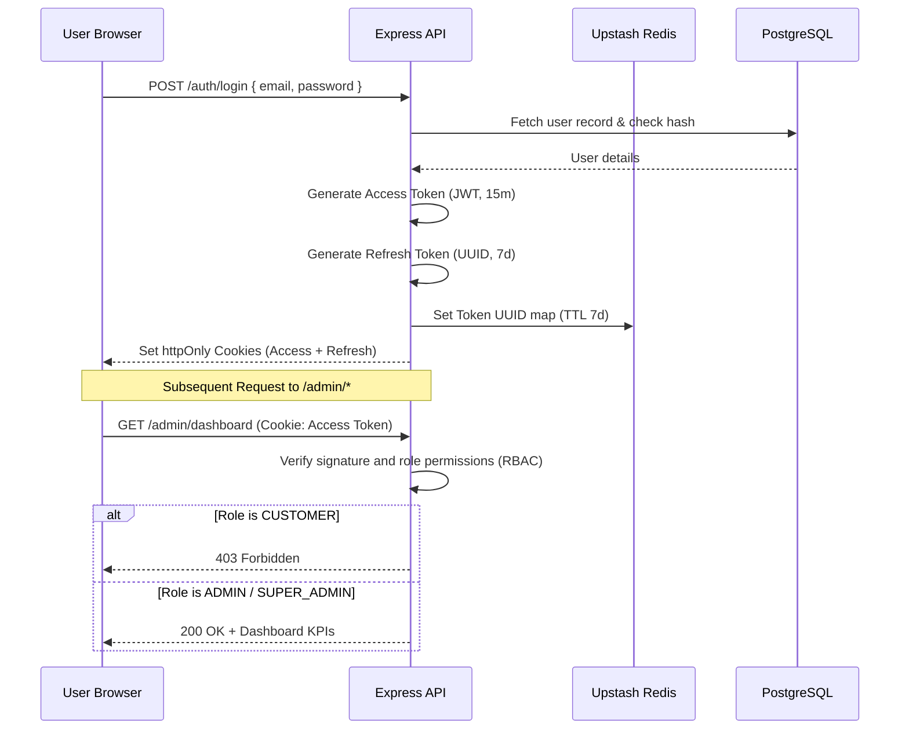
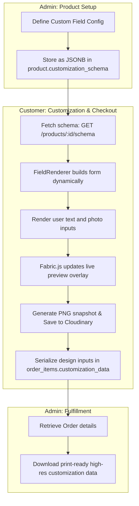
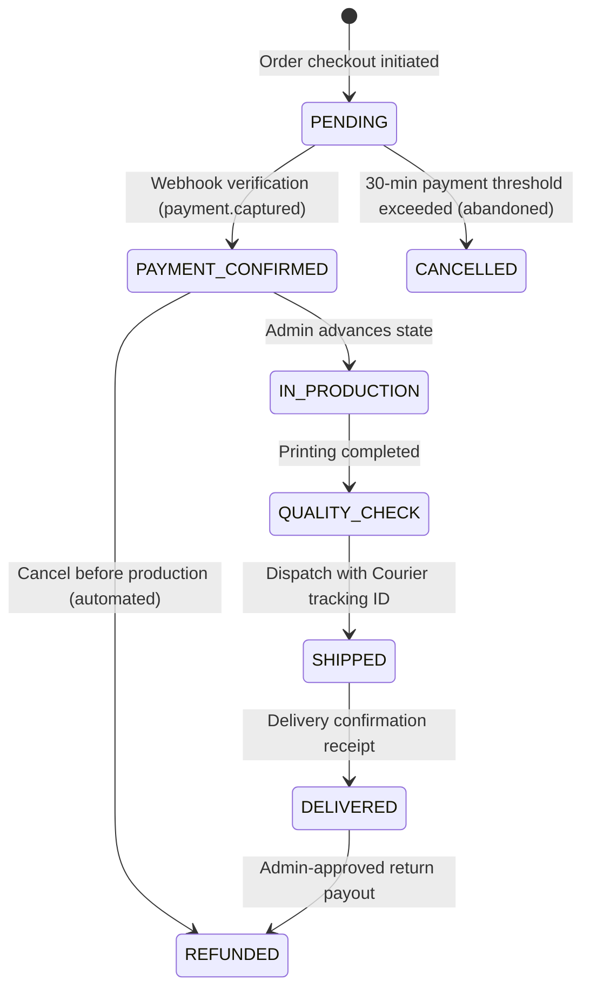

# Enterprise Architecture Specification

This document details the architectural layers and technical implementation patterns of the MERKO Customizable Product Marketplace.

---

## 🏢 Monorepo Structure

MERKO is organized as a unified monorepo using **pnpm workspaces** and **Turborepo** build caching. This enforces:
* **Strict Type Sharing:** Shared types and schemas in `packages/types/` prevent desynchronization between API payloads and client components.
* **Reusable UI Toolkit:** `packages/ui/` exports the shared Tailwind + Shadcn UI library, ensuring design consistency between the customer store and the admin portal.
* **Global Configurations:** Centralized configurations in `packages/config/` govern ESLint rules, environment checking, and build parameters.

---

## 🔒 Authentication & Role-Based Access Control (RBAC)

---

## ⚙️ Dynamic Customization Engine Flow

The engine maps admin field configurations directly into reactive customer customization panels.

---

## 🚀 Payment & Transaction Lifecycle

All order state mutations occur within transactional SQL batches.

For detailed specifications of the backend server and operational runbooks, refer to [Architecture Documentation](docs/architecture.md).
