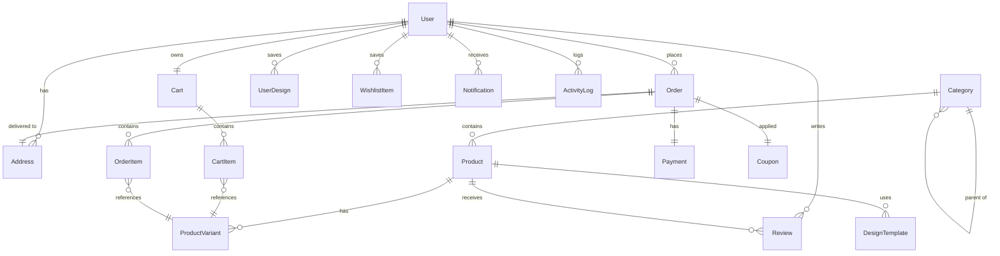

# Database Architecture & Schema

The MERKO platform uses **PostgreSQL** as its primary relational engine, managed through **Prisma ORM**.

---

## 🗄️ Database ER Diagram



---

## 📈 Performance Optimizations & Indexes

```sql
-- Full-text search GIN index on product catalogs
CREATE INDEX idx_products_fts ON products USING gin(to_tsvector('english', name || ' ' || description));

-- Composite index optimizing Admin order queue listing sorted by creation date
CREATE INDEX idx_orders_status_created ON orders(status, created_at DESC);

-- Unique index restricting double adding the same variant to a cart
CREATE UNIQUE INDEX idx_cart_item_unique ON cart_items(cart_id, variant_id);

-- Partitioned Indexing matching active, unread notifications for notification count queries
CREATE INDEX idx_notifications_user_unread ON notifications(user_id, created_at DESC) WHERE is_read = false;
```

For the complete Prisma schema models and detail mappings, see the [Database Documentation](docs/database.md).
