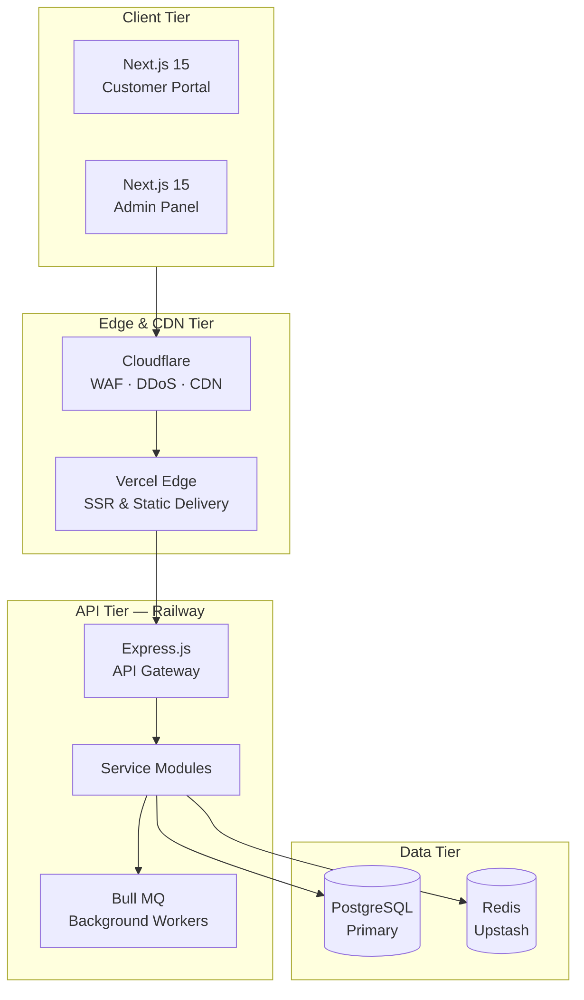

# MERKO — Enterprise Customizable Product Marketplace

[](https://nextjs.org)
[](https://expressjs.com)
[](https://www.postgresql.org)
[](https://www.prisma.io)
[](https://redis.io)
[](LICENSE)
[](CONTRIBUTING.md)

MERKO is a production-grade, Flipkart-style e-commerce marketplace that enables customers to browse, personalize, and purchase customized physical goods (such as ID cards, mugs, T-shirts, and banners). The platform differentiates itself through a dynamic, admin-configurable customization engine that allows product managers to define custom fields, validation rules, and live preview logic without writing a single line of code.

Built as a highly optimized monorepo using **pnpm workspaces** and **Turborepo**, MERKO integrates an Express.js API, a Customer Portal (Next.js), a Management Portal (Next.js), and shared package libraries.

---

## 🌟 Key Features

* **Dynamic Customization Engine:** Admin-configurable custom fields (text, upload, dropdown, dimension, etc.) defined via JSONB schemas.
* **Live preview canvas:** High-performance preview rendering using Fabric.js / HTML5 Canvas.
* **Persistent & Guest Cart:** DB-backed user carts that sync seamlessly across devices, with automated local-to-DB migration on login.
* **Payment Gateway:** Sandboxed payments powered by Razorpay with HMAC signature verification.
* **Transactional Notifications:** High-reliability background worker (Bull MQ) sending SMS (Twilio), Email (SendGrid), and Push notifications (FCM).
* **Fulfillment Pipeline:** Structured order status transitions linked to Courier logistics (BlueDart tracking).
* **Return & Refund System:** Customer self-service return filing, admin moderation, and automated refund trigger.

---

## 📸 Screenshots

| Customer Portal Home | Customization Panel | Admin Dashboard |
| :---: | :---: | :---: |
|  |  |  |

---

## 🛠️ Tech Stack

* **Frontend:** Next.js 15 (App Router), React 18, Zustand (State), TanStack Query (Caching), Tailwind CSS + Shadcn UI
* **Backend:** Node.js 20, Express.js, TypeScript, Prisma ORM, Winston Logger
* **Database & Caching:** PostgreSQL 16 (Primary + Read Replica), Redis 7 (Upstash managed)
* **Infrastructure:** Docker, Docker Compose, Railway (Backend), Vercel (Frontend), Cloudflare (CDN & Edge WAF)
* **Integrations:** Razorpay (Payments), Cloudinary (Media Transformation), SendGrid (Emails), Twilio (SMS/WhatsApp), Firebase Cloud Messaging (Push)

---

## 🏢 System Architecture



For a deeper dive into the system architecture and database design, read the [Architecture Documentation](docs/architecture.md) and [Database Documentation](docs/database.md).

---

## 📁 Folder Structure

```
merko-monorepo/
├── .github/                   ← CI/CD workflows and templates
├── docs/                      ← Technical documentation & phase reports
├── apps/
│   ├── api/                   ← Express.js backend API service
│   ├── customer/              ← Next.js 15 customer storefront
│   └── management/            ← Next.js 15 administration portal
├── packages/
│   ├── config/                ← Shared build and environment config
│   ├── types/                 ← Shared TypeScript definitions & schemas
│   └── ui/                    ← Shared design system components
├── package.json               ← Root monorepo configuration
├── pnpm-workspace.yaml        ← pnpm workspace definitions
└── turbo.json                 ← Turborepo pipeline configuration
```

For more details, see the [Project Structure Documentation](PROJECT_STRUCTURE.md).

---

## 🚀 Installation & Local Development

### Prerequisites
* **Node.js** v20.x
* **pnpm** v9.x
* **Docker** & **Docker Compose**

### Setup Steps
1. Clone the repository:
   ```bash
   git clone https://github.com/your-org/merko.git
   cd merko
   ```
2. Install monorepo dependencies:
   ```bash
   pnpm install
   ```
3. Set up local services (PostgreSQL & Redis) using Docker Compose:
   ```bash
   docker compose up -d
   ```
4. Configure environment variables. Copy `.env.example` in `apps/api/` to `.env` and configure your credentials. See [Environment Variables](DEPLOYMENT.md#environment-variables) for details.
5. Apply database migrations:
   ```bash
   cd apps/api && pnpm prisma db push
   ```
6. Start the development server for all services:
   ```bash
   cd ../../ && pnpm dev
   ```
   * **Customer Portal:** `http://localhost:3000`
   * **Management Portal:** `http://localhost:3001`
   * **API Gateway:** `http://localhost:4000`

For detailed production build instructions, see the [Deployment Guide](DEPLOYMENT.md).

---

## 🧪 Testing

We use Jest for unit and integration testing, and Playwright for end-to-end testing.

```bash
# Run unit tests across all packages
pnpm test

# Run unit tests for a specific app (e.g. apps/api)
pnpm --filter @merko/api test

# Run Playwright E2E tests
pnpm test:e2e
```
For detailed testing strategy and configurations, read the [Testing Documentation](docs/testing.md).

---

## 🔒 Security Policy

Please review our [Security Policy](SECURITY.md) to report vulnerabilities privately. Do not open public issues for security concerns.

---

## 🗺️ Product Roadmap

* **Phase 1-12 (MVP):** Core customizable e-commerce features (Complete).
* **v1.1.0:** Bulk B2B ordering portal with custom pricing tiers.
* **v1.2.0:** Multi-tenant vendor dashboard for secondary printers.
* **v1.3.0:** AI-powered print image upscaling and design helper.

See the full roadmap in [ROADMAP.md](ROADMAP.md).

---

## 📄 License

This project is licensed under the MIT License — see the [LICENSE](LICENSE) file for details.
