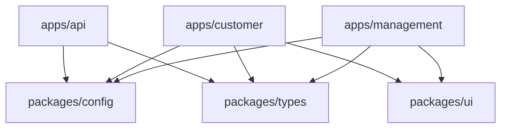
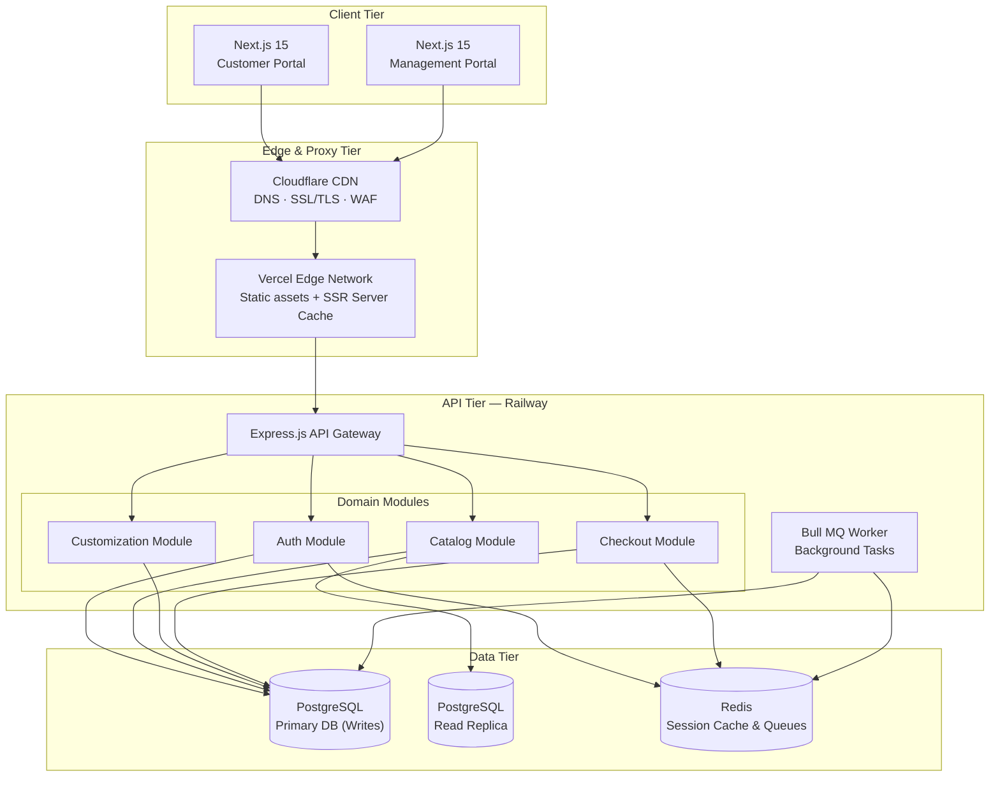
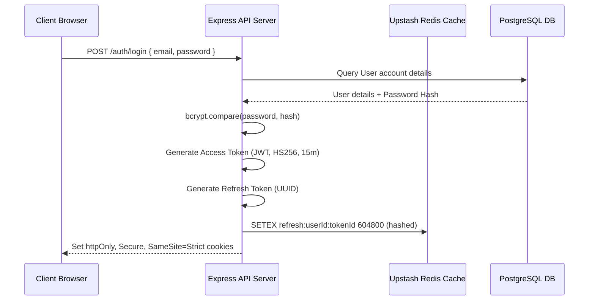
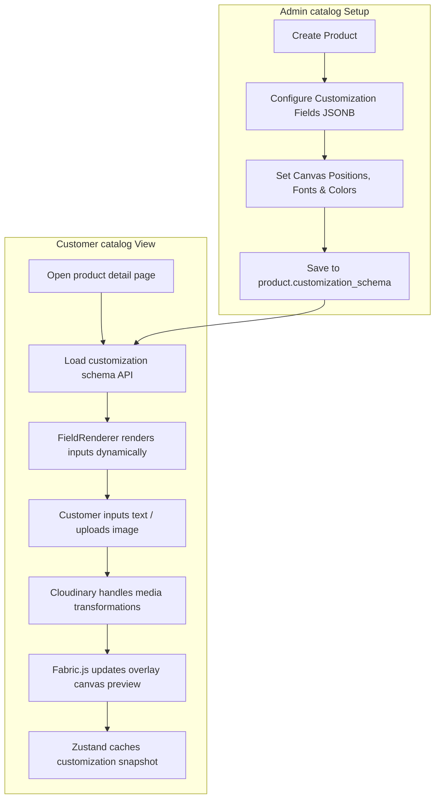
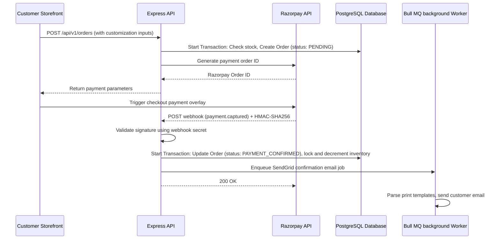

# System Architecture Specification

This document details the architectural layout, package interactions, security enforcement, and database transaction pipelines of the MERKO Customizable Product Marketplace.

---

## 1. Monorepo Structural Layout

MERKO uses **pnpm workspaces** and **Turborepo** to orchestrate dependencies, task scheduling, and remote compilation caches.

```
merko-monorepo/
├── apps/
│   ├── api/                   ← Express.js REST API
│   ├── customer/              ← Next.js 15 Customer Storefront
│   └── management/            ← Next.js 15 Admin Portal
└── packages/
    ├── config/                ← Workspace-shared configurations
    ├── types/                 ← Shared TypeScript definitions & Zod DTO validations
    └── ui/                    ← Shared React design system component packages
```

Dependencies flow strictly from packages to apps:



---

## 2. Technical Stack Topology

The system uses a tiered application model to separate the presentation layer, edge proxying, business routing, and datastore engines.



---

## 3. Core Information & Security Flows

### 3.1 Authentication Sequence
The API secures sessions using short-lived access tokens and long-lived refresh tokens stored inside httpOnly cookies:



### 3.2 Role-Based Access Control (RBAC) Flow
Access permissions are verified in the Express routing pipeline using a custom role check middleware:

```mermaid
flowchart TD
    A[Incoming Request] --> B{JWT token valid?}
    B -- No --> C[Return 401 Unauthorized]
    B -- Yes --> D[Extract Role: CUSTOMER | ADMIN | SUPER_ADMIN]
    D --> E{Route requirement}
    E -- Scoped to Admin --> F{Is ADMIN or SUPER_ADMIN?}
    F -- No --> G[Return 403 Forbidden]
    F -- Yes --> H[Proceed to Domain Controller]
    E -- Scoped to Super Admin --> I{Is SUPER_ADMIN?}
    I -- No --> G
    I -- Yes --> H
    E -- General access --> H
```

---

## 4. Product Catalog & Customization Flow

The customization engine dynamically loads fields defined by admins and updates live canvas overlays before serializing input data at checkout.



---

## 5. Order & Transaction Lifecycle

Orders process through a series of transactional states, securing payment via HMAC signatures before generating print files.


