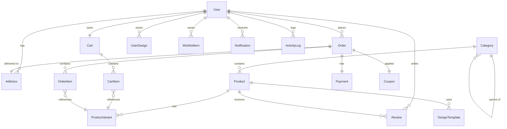

# Database Schema & Models Specification

This document defines the database architecture, schema models, and data types for the MERKO Customizable Product Marketplace.

---

## 1. Entity Relationship (ER) Diagram

---

## 2. Core Tables & Schema Specifications

### 2.1 Users (`User`)
Stores account profiles, authentication states, and systemic access roles.

| Column Name | Data Type | Constraints | Description |
| :--- | :--- | :--- | :--- |
| `id` | UUID | Primary Key | Unique account identifier. |
| `email` | String | Unique, Index | Registered contact email. |
| `phone` | String | Unique, Nullable | Registered SMS phone number. |
| `passwordHash` | String | Not Null | bcrypt cost-12 password hash. |
| `name` | String | Not Null | User profile name. |
| `role` | Enum | Default: `CUSTOMER` | System access role: `CUSTOMER`, `ADMIN`, `SUPER_ADMIN`. |
| `isVerified` | Boolean | Default: `false` | True if the email/phone OTP verification completed. |
| `isActive` | Boolean | Default: `true` | False if the account was administrative suspended. |

---

### 2.2 Products & Catalog (`Product`, `Category`, `ProductVariant`)
Models the marketplace catalog, structural hierarchies, and dimensional variants.

#### `Product` Table
| Column Name | Data Type | Constraints | Description |
| :--- | :--- | :--- | :--- |
| `id` | UUID | Primary Key | Unique product identifier. |
| `categoryId` | UUID | Foreign Key | Links to product `Category`. |
| `name` | String | Not Null | Storefront display name. |
| `slug` | String | Unique, Index | URL-friendly name. |
| `description` | Text | Not Null | Product catalog detail text. |
| `basePriceInPaise`| Integer | Not Null | Catalog base price (stored in Indian Paise to avoid decimal drift). |
| `sku` | String | Unique | Base Stock Keeping Unit. |
| `isCustomizable` | Boolean | Default: `false` | Enables customization forms on PDP views. |
| `customizationSchema`| JSONB | Nullable | Admin-configured list of fields and validation parameters. |
| `images` | JSONB | Not Null | List of Cloudinary URL paths. |

#### `ProductVariant` Table
| Column Name | Data Type | Constraints | Description |
| :--- | :--- | :--- | :--- |
| `id` | UUID | Primary Key | Unique variant identifier. |
| `productId` | UUID | Foreign Key | Reference linking to parent `Product`. |
| `name` | String | Not Null | Variant label (e.g. "Size XL, Blue"). |
| `options` | JSONB | Not Null | Key-value attributes (e.g. `{"size": "XL", "color": "blue"}`). |
| `priceDeltaPaise`| Integer | Default: `0` | Price modifier added to base product price. |
| `stock` | Integer | Default: `0` | Active inventory levels. |

---

### 2.3 Cart & Wishlist (`Cart`, `CartItem`, `WishlistItem`)
Maintains customer products selected for future checkout.

#### `CartItem` Table
| Column Name | Data Type | Constraints | Description |
| :--- | :--- | :--- | :--- |
| `id` | UUID | Primary Key | Unique item identifier. |
| `cartId` | UUID | Foreign Key | Link to parent `Cart`. |
| `variantId` | UUID | Foreign Key | Links to selected `ProductVariant`. |
| `quantity` | Integer | Not Null | Quantity of variant selected. |
| `customizationData`| JSONB | Nullable | Snapped design inputs filled by the customer. |
| `unitPriceInPaise`| Integer | Not Null | Price including variant delta surcharges at add time. |

#### `WishlistItem` Table
| Column Name | Data Type | Constraints | Description |
| :--- | :--- | :--- | :--- |
| `id` | UUID | Primary Key | Unique item identifier. |
| `userId` | UUID | Foreign Key | Links to owner `User`. |
| `productId` | UUID | Foreign Key | Links to wishlisted `Product`. |

---

### 2.4 Orders & Checkout (`Order`, `OrderItem`, `Payment`)
Tracks historical orders, payment states, and shipping schedules.

#### `Order` Table
| Column Name | Data Type | Constraints | Description |
| :--- | :--- | :--- | :--- |
| `id` | UUID | Primary Key | Unique order identifier. |
| `orderNumber` | String | Unique, Index | Human-readable ID (e.g. `MRK-698421-3424`). |
| `userId` | UUID | Foreign Key | Link to checkout `User`. |
| `addressId` | UUID | Foreign Key | Shipping address identifier. |
| `couponId` | UUID | Foreign Key, Nullable| Link to applied discount code. |
| `status` | Enum | Default: `PENDING` | Status workflow: `PENDING`, `PAYMENT_CONFIRMED`, `IN_PRODUCTION`, `QUALITY_CHECK`, `SHIPPED`, `DELIVERED`, `CANCELLED`, `REFUNDED`. |
| `totalPaise` | Integer | Not Null | Final checkout charge (subtotal - discount + shipping). |

#### `Payment` Table
| Column Name | Data Type | Constraints | Description |
| :--- | :--- | :--- | :--- |
| `id` | UUID | Primary Key | Unique payment transaction identifier. |
| `orderId` | UUID | Foreign Key, Unique| Links to matching `Order`. |
| `razorpayOrderId` | String | Unique | Order identifier from Razorpay. |
| `razorpayPaymentId`| String | Nullable | Payment transaction ID from Razorpay. |
| `status` | Enum | Default: `CREATED` | Transaction state: `CREATED`, `CAPTURED`, `FAILED`, `REFUNDED`. |
