# Merko — Enterprise Architecture & Product Documentation

> **Classification:** Internal Technical Reference  
> **Version:** 1.0.0  
> **Status:** Draft for Review  
> **Stack:** Next.js 15 · Node.js · PostgreSQL · Prisma · Cloudinary · Razorpay  

---

## Table of Contents

1. [Product Requirements Document](#1-product-requirements-document)
2. [User Roles](#2-user-roles)
3. [User Journeys](#3-user-journeys)
4. [Admin Journeys](#4-admin-journeys)
5. [Functional Requirements](#5-functional-requirements)
6. [Non-Functional Requirements](#6-non-functional-requirements)
7. [High-Level Architecture](#7-high-level-architecture)
8. [Detailed Component Architecture](#8-detailed-component-architecture)
9. [Database ER Diagram](#9-database-er-diagram)
10. [PostgreSQL Schema Design](#10-postgresql-schema-design)
11. [API Architecture](#11-api-architecture)
12. [Security Architecture](#12-security-architecture)
13. [File Storage Architecture](#13-file-storage-architecture)
14. [Payment Architecture](#14-payment-architecture)
15. [Notification Architecture](#15-notification-architecture)
16. [Deployment Architecture](#16-deployment-architecture)
17. [Monitoring Architecture](#17-monitoring-architecture)
18. [Scalability Strategy](#18-scalability-strategy)
19. [CI/CD Architecture](#19-cicd-architecture)

---

## 1. Product Requirements Document

### 1.1 Executive Summary

Merko is a Flipkart-style customizable product marketplace that enables customers to browse, personalize, and purchase printed and customized physical goods — ID cards, mugs, T-shirts, banners, and more. The platform differentiates itself through a dynamic, admin-configurable customization engine that allows product managers to define custom fields, input types, and preview logic without any code changes.

### 1.2 Problem Statement

| Problem | Impact |
|---|---|
| Local printing businesses have no digital storefront | Lost revenue, no reach beyond walk-ins |
| Customers cannot preview customized products before ordering | High return rates, low conversion |
| Admin teams must involve developers to add new product fields | Slow time-to-market, high operational cost |
| No centralized order + production tracking for print businesses | Fulfillment errors, poor customer experience |

### 1.3 Product Vision

> *"Make professional customized printing accessible to everyone — browse, personalize, preview, and order in under 5 minutes."*

### 1.4 Success Metrics

| Metric | Target (6 months) |
|---|---|
| Registered users | 10,000+ |
| Monthly active orders | 2,000+ |
| Average order value | ₹350+ |
| Cart-to-checkout conversion | ≥ 35% |
| Page load time (LCP) | < 2.5s |
| Uptime | ≥ 99.9% |
| Admin field setup time | < 10 minutes (no code) |

### 1.5 Scope

**In Scope (v1 MVP)**
- Product catalog with categories and search
- Dynamic customization engine (admin-configured fields)
- Live design preview for customizable products
- File upload (photos, logos, designs)
- Cart and multi-product checkout
- Razorpay payment integration (UPI, Card, NetBanking)
- Order tracking with status updates
- Customer notifications (Email + WhatsApp + Push)
- Admin panel: product, order, user, coupon management
- JWT authentication with refresh tokens

**Out of Scope (v2+)**
- Vendor multi-seller portal
- AI design suggestion engine
- Mobile native app (iOS/Android)
- Loyalty/referral programs
- Bulk B2B order portal

---

## 2. User Roles

### 2.1 Role Matrix

| Capability | Guest | Customer | Admin | Super Admin |
|---|:---:|:---:|:---:|:---:|
| Browse products | ✓ | ✓ | ✓ | ✓ |
| Search & filter | ✓ | ✓ | ✓ | ✓ |
| Customize product | ✓ (preview only) | ✓ | ✓ | ✓ |
| Add to cart | ✗ | ✓ | ✗ | ✗ |
| Checkout & pay | ✗ | ✓ | ✗ | ✗ |
| Track orders | ✗ | ✓ | ✓ | ✓ |
| Manage own profile | ✗ | ✓ | ✓ | ✓ |
| Write reviews | ✗ | ✓ | ✗ | ✗ |
| Manage products | ✗ | ✗ | ✓ | ✓ |
| Manage custom fields | ✗ | ✗ | ✓ | ✓ |
| Manage orders | ✗ | ✗ | ✓ | ✓ |
| Manage users | ✗ | ✗ | ✗ | ✓ |
| Manage coupons | ✗ | ✗ | ✓ | ✓ |
| View analytics | ✗ | ✗ | ✓ | ✓ |
| Manage admins | ✗ | ✗ | ✗ | ✓ |
| System configuration | ✗ | ✗ | ✗ | ✓ |

### 2.2 Role Definitions

**Guest**
- Unauthenticated visitor
- Can browse, search, preview customizations
- Cannot persist cart or complete purchase
- Prompted to register at cart/checkout

**Customer**
- Registered, verified user
- Full shopping journey access
- Can manage saved addresses, order history, saved designs
- Can submit reviews post-delivery

**Admin**
- Operations team member
- Manages product catalog, customization fields, orders, gallery, coupons
- Cannot manage other admin accounts
- Access scoped to operational data

**Super Admin**
- Full system access
- Manages admin accounts and roles
- Access to system configuration, raw analytics, audit logs
- Can impersonate users for support purposes (logged)

---

## 3. User Journeys

### 3.1 Customer Registration & Onboarding

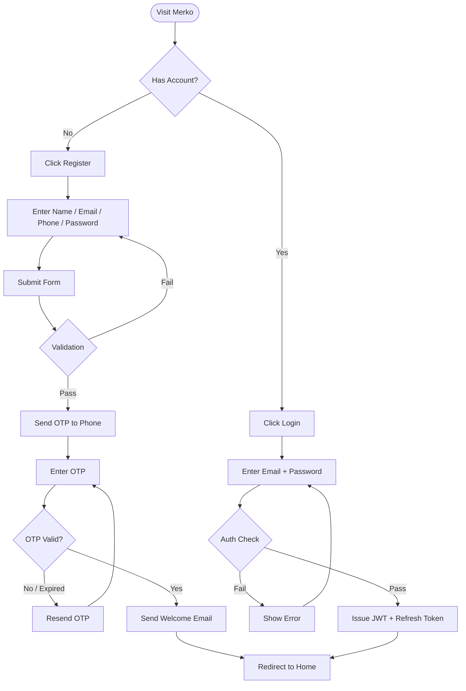
```mermaid
flowchart TD
    A([Visit Merko]) --> B{Has Account?}
    B -- No --> C[Click Register]
    C --> D[Enter Name / Email / Phone / Password]
    D --> E[Submit Form]
    E --> F{Validation}
    F -- Fail --> D
    F -- Pass --> G[Send OTP to Phone]
    G --> H[Enter OTP]
    H --> I{OTP Valid?}
    I -- No / Expired --> J[Resend OTP]
    J --> H
    I -- Yes --> K[Send Welcome Email]
    K --> L[Redirect to Home]
    B -- Yes --> M[Click Login]
    M --> N[Enter Email + Password]
    N --> O{Auth Check}
    O -- Fail --> P[Show Error]
    P --> N
    O -- Pass --> Q[Issue JWT + Refresh Token]
    Q --> L
```

### 3.2 Product Discovery & Customization

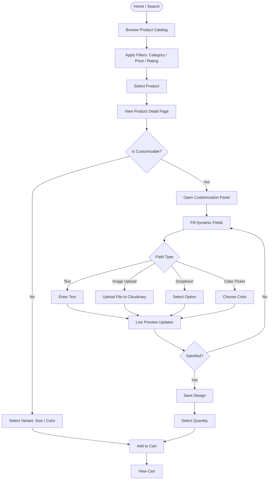
```mermaid
flowchart TD
    A([Home / Search]) --> B[Browse Product Catalog]
    B --> C[Apply Filters: Category / Price / Rating]
    C --> D[Select Product]
    D --> E[View Product Detail Page]
    E --> F{Is Customizable?}
    F -- No --> G[Select Variant: Size / Color]
    G --> H[Add to Cart]
    F -- Yes --> I[Open Customization Panel]
    I --> J[Fill Dynamic Fields]
    J --> K{Field Type}
    K -- Text --> L[Enter Text]
    K -- Image Upload --> M[Upload File to Cloudinary]
    K -- Dropdown --> N[Select Option]
    K -- Color Picker --> O[Choose Color]
    L & M & N & O --> P[Live Preview Updates]
    P --> Q{Satisfied?}
    Q -- No --> J
    Q -- Yes --> R[Save Design]
    R --> S[Select Quantity]
    S --> H
    H --> T[View Cart]
```

### 3.3 Checkout & Payment

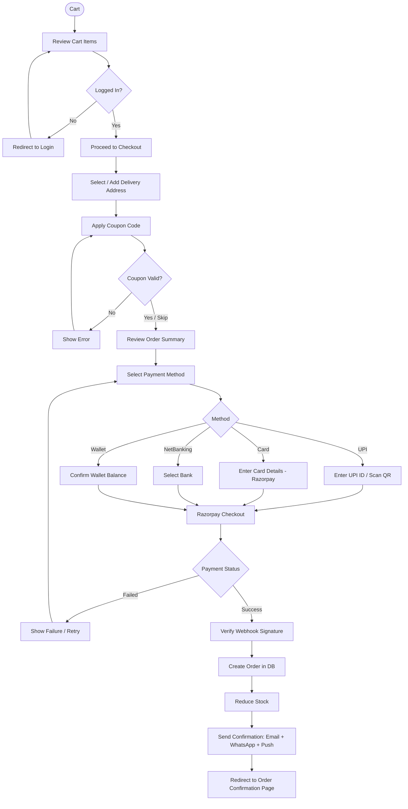
```mermaid
flowchart TD
    A([Cart]) --> B[Review Cart Items]
    B --> C{Logged In?}
    C -- No --> D[Redirect to Login]
    D --> B
    C -- Yes --> E[Proceed to Checkout]
    E --> F[Select / Add Delivery Address]
    F --> G[Apply Coupon Code]
    G --> H{Coupon Valid?}
    H -- No --> I[Show Error]
    I --> G
    H -- Yes / Skip --> J[Review Order Summary]
    J --> K[Select Payment Method]
    K --> L{Method}
    L -- UPI --> M[Enter UPI ID / Scan QR]
    L -- Card --> N[Enter Card Details - Razorpay]
    L -- NetBanking --> O[Select Bank]
    L -- Wallet --> P[Confirm Wallet Balance]
    M & N & O & P --> Q[Razorpay Checkout]
    Q --> R{Payment Status}
    R -- Failed --> S[Show Failure / Retry]
    S --> K
    R -- Success --> T[Verify Webhook Signature]
    T --> U[Create Order in DB]
    U --> V[Reduce Stock]
    V --> W[Send Confirmation: Email + WhatsApp + Push]
    W --> X[Redirect to Order Confirmation Page]
```

### 3.4 Order Tracking

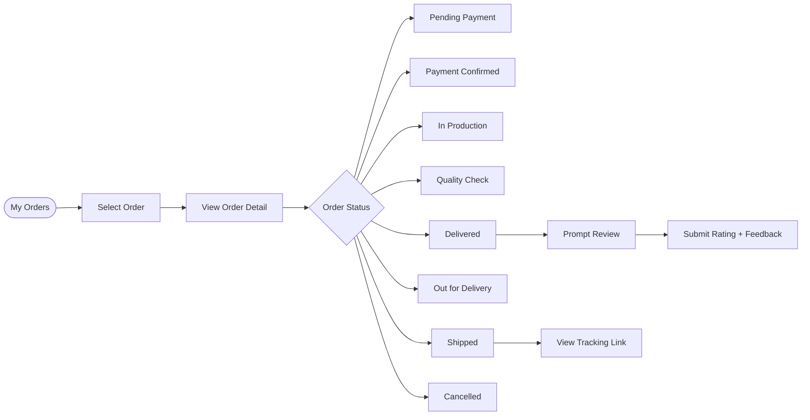
```mermaid
flowchart LR
    A([My Orders]) --> B[Select Order]
    B --> C[View Order Detail]
    C --> D{Order Status}
    D --> E[Pending Payment]
    D --> F[Payment Confirmed]
    D --> G[In Production]
    D --> H[Quality Check]
    D --> I[Shipped]
    D --> J[Out for Delivery]
    D --> K[Delivered]
    D --> L[Cancelled]
    K --> M[Prompt Review]
    M --> N[Submit Rating + Feedback]
    I --> O[View Tracking Link]
```

---

## 4. Admin Journeys

### 4.1 Product & Customization Field Management

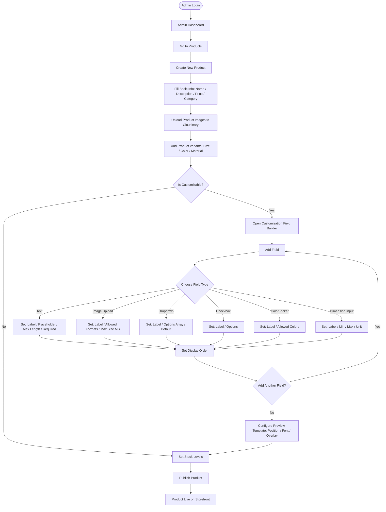
```mermaid
flowchart TD
    A([Admin Login]) --> B[Admin Dashboard]
    B --> C[Go to Products]
    C --> D[Create New Product]
    D --> E[Fill Basic Info: Name / Description / Price / Category]
    E --> F[Upload Product Images to Cloudinary]
    F --> G[Add Product Variants: Size / Color / Material]
    G --> H{Is Customizable?}
    H -- No --> I[Set Stock Levels]
    H -- Yes --> J[Open Customization Field Builder]
    J --> K[Add Field]
    K --> L{Choose Field Type}
    L -- Text --> M[Set: Label / Placeholder / Max Length / Required]
    L -- Image Upload --> N[Set: Label / Allowed Formats / Max Size MB]
    L -- Dropdown --> O[Set: Label / Options Array / Default]
    L -- Checkbox --> P[Set: Label / Options]
    L -- Color Picker --> Q[Set: Label / Allowed Colors]
    L -- Dimension Input --> R[Set: Label / Min / Max / Unit]
    M & N & O & P & Q & R --> S[Set Display Order]
    S --> T{Add Another Field?}
    T -- Yes --> K
    T -- No --> U[Configure Preview Template: Position / Font / Overlay]
    U --> I
    I --> V[Publish Product]
    V --> W[Product Live on Storefront]
```

### 4.2 Order Management & Fulfillment

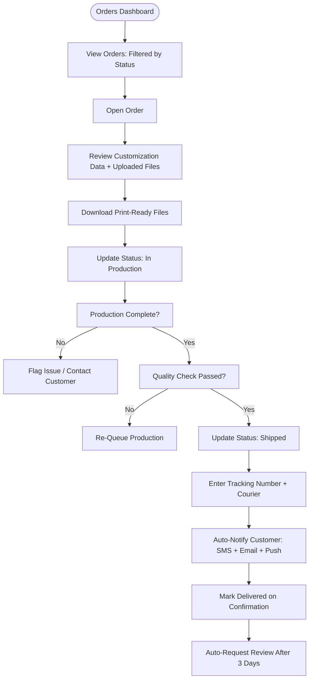
```mermaid
flowchart TD
    A([Orders Dashboard]) --> B[View Orders: Filtered by Status]
    B --> C[Open Order]
    C --> D[Review Customization Data + Uploaded Files]
    D --> E[Download Print-Ready Files]
    E --> F[Update Status: In Production]
    F --> G[Production Complete?]
    G -- No --> H[Flag Issue / Contact Customer]
    G -- Yes --> I[Quality Check Passed?]
    I -- No --> J[Re-Queue Production]
    I -- Yes --> K[Update Status: Shipped]
    K --> L[Enter Tracking Number + Courier]
    L --> M[Auto-Notify Customer: SMS + Email + Push]
    M --> N[Mark Delivered on Confirmation]
    N --> O[Auto-Request Review After 3 Days]
```

### 4.3 Analytics & Reporting

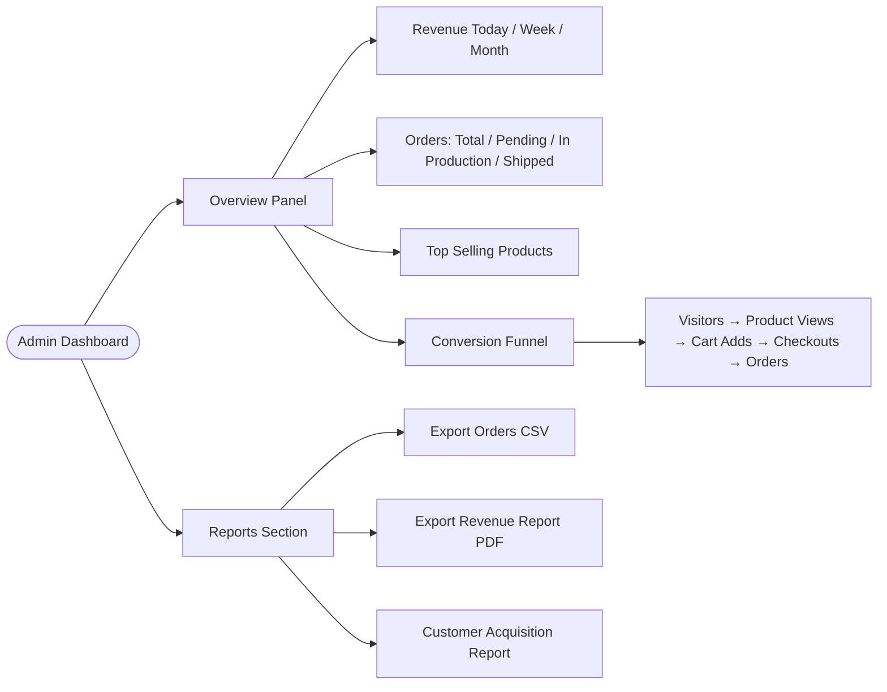
```mermaid
flowchart LR
    A([Admin Dashboard]) --> B[Overview Panel]
    B --> C[Revenue Today / Week / Month]
    B --> D[Orders: Total / Pending / In Production / Shipped]
    B --> E[Top Selling Products]
    B --> F[Conversion Funnel]
    F --> G[Visitors → Product Views → Cart Adds → Checkouts → Orders]
    A --> H[Reports Section]
    H --> I[Export Orders CSV]
    H --> J[Export Revenue Report PDF]
    H --> K[Customer Acquisition Report]
```

---

## 5. Functional Requirements

### 5.1 Authentication Module

| ID | Requirement | Priority |
|---|---|:---:|
| AUTH-01 | User registration with name, email, phone, password | P0 |
| AUTH-02 | Phone OTP verification on registration | P0 |
| AUTH-03 | Login with email + password | P0 |
| AUTH-04 | JWT access token (15-min) + refresh token (7-day) | P0 |
| AUTH-05 | Refresh token rotation — invalidate old on use | P0 |
| AUTH-06 | Forgot password via email OTP | P1 |
| AUTH-07 | Google OAuth SSO | P2 |
| AUTH-08 | Admin login with 2FA (TOTP) | P1 |
| AUTH-09 | Session revocation from admin panel | P1 |

### 5.2 Product & Catalog Module

| ID | Requirement | Priority |
|---|---|:---:|
| PROD-01 | Product listing with pagination (20/page) | P0 |
| PROD-02 | Category hierarchy (parent/child) | P0 |
| PROD-03 | Full-text product search (name + description) | P0 |
| PROD-04 | Filter by: category, price range, rating, availability | P0 |
| PROD-05 | Sort by: price asc/desc, newest, best-selling | P0 |
| PROD-06 | Product detail page with image gallery | P0 |
| PROD-07 | Product variants (size, color, material) with individual pricing/stock | P0 |
| PROD-08 | Related products section | P1 |
| PROD-09 | Recently viewed products (local + DB) | P1 |
| PROD-10 | Product availability / stock status real-time | P0 |

### 5.3 Dynamic Customization Engine

| ID | Requirement | Priority |
|---|---|:---:|
| CUST-01 | Admin defines custom fields per product without code changes | P0 |
| CUST-02 | Field types: text, textarea, number, image upload, dropdown, checkbox, radio, color picker, dimension | P0 |
| CUST-03 | Field-level validation: required, min/max length, format, file type | P0 |
| CUST-04 | Drag-and-drop field ordering by admin | P1 |
| CUST-05 | Live preview canvas updates on every field change | P0 |
| CUST-06 | Preview template: define text position, font, image area per product type | P0 |
| CUST-07 | Save design to user account for reuse | P1 |
| CUST-08 | Customization data serialized as JSONB and stored with order item | P0 |
| CUST-09 | Admin can preview customer's customization data from order panel | P0 |
| CUST-10 | Print-ready file generation (PDF/PNG export) with customer data injected | P1 |

### 5.4 Cart & Order Module

| ID | Requirement | Priority |
|---|---|:---:|
| CART-01 | Persistent cart (DB-backed for auth users) | P0 |
| CART-02 | Guest cart (localStorage, migrate on login) | P1 |
| CART-03 | Add / update quantity / remove cart items | P0 |
| CART-04 | Cart item includes product variant + customization snapshot | P0 |
| CART-05 | Dynamic pricing: base price + variant delta + customization surcharge | P0 |
| CART-06 | Coupon code application with live discount calculation | P0 |
| ORD-01 | Order creation atomically (cart → order + order_items) | P0 |
| ORD-02 | Order status lifecycle: pending → confirmed → production → shipped → delivered | P0 |
| ORD-03 | Order cancellation (before production) with auto-refund trigger | P1 |
| ORD-04 | Order history with filters and pagination | P0 |
| ORD-05 | Re-order functionality (copy last order to cart) | P2 |

### 5.5 Payment Module

| ID | Requirement | Priority |
|---|---|:---:|
| PAY-01 | Razorpay checkout: UPI, card, netbanking, wallets | P0 |
| PAY-02 | Webhook signature verification for all payment events | P0 |
| PAY-03 | Idempotency key on all payment creation requests | P0 |
| PAY-04 | Refund initiation from admin panel | P1 |
| PAY-05 | Payment failure retry (3 attempts before abandonment) | P0 |
| PAY-06 | Invoice PDF auto-generation and email attachment | P1 |

### 5.6 Admin Module

| ID | Requirement | Priority |
|---|---|:---:|
| ADM-01 | Admin dashboard: revenue, orders, top products KPIs | P0 |
| ADM-02 | Product CRUD with image upload and variant management | P0 |
| ADM-03 | Dynamic field builder per product (no-code) | P0 |
| ADM-04 | Order management with status pipeline | P0 |
| ADM-05 | Customer list with order history and account status | P1 |
| ADM-06 | Coupon creation: percentage, flat, free-shipping types | P1 |
| ADM-07 | Gallery management (upload portfolio/completed work) | P1 |
| ADM-08 | Review moderation (approve/reject/reply) | P1 |
| ADM-09 | Export orders and revenue as CSV/PDF | P1 |
| ADM-10 | Notification broadcast to all customers | P2 |

---

## 6. Non-Functional Requirements

### 6.1 Performance

| Metric | Target | Measurement |
|---|---|---|
| Largest Contentful Paint (LCP) | < 2.5s | Vercel Speed Insights |
| First Input Delay (FID) | < 100ms | Core Web Vitals |
| API P95 response time | < 300ms | Railway Metrics |
| API P99 response time | < 800ms | Railway Metrics |
| Database query P95 | < 50ms | pg_stat_statements |
| File upload processing | < 3s (≤5MB) | Cloudinary API |
| Customization preview render | < 200ms | Client-side |

### 6.2 Scalability

| Dimension | Target |
|---|---|
| Concurrent users | 10,000+ |
| Peak orders/hour | 500 |
| File uploads/hour | 2,000 |
| Database connections (pooled) | 100 max (PgBouncer) |
| Storage growth tolerance | 100GB/year Cloudinary |

### 6.3 Security

| Requirement | Standard |
|---|---|
| Password hashing | bcrypt, cost factor 12 |
| Transport encryption | TLS 1.3, HSTS |
| JWT signing | HS256, secrets rotated quarterly |
| File upload validation | MIME type + magic bytes + virus scan |
| SQL injection prevention | Prisma parameterized queries only |
| XSS prevention | CSP headers, sanitized input |
| Payment data | PCI-DSS scope minimized — no card data stored |
| Rate limiting | 100 req/min general; 5/min auth endpoints |

### 6.4 Availability & Reliability

| Metric | Target |
|---|---|
| Uptime SLA | 99.9% (< 8.7 hrs downtime/year) |
| RTO (Recovery Time Objective) | < 1 hour |
| RPO (Recovery Point Objective) | < 15 minutes |
| Database backup | Daily full + continuous WAL |
| Deployment rollback | < 5 minutes via Vercel/Railway |

### 6.5 Compliance & Accessibility

- WCAG 2.1 AA accessibility compliance
- GDPR-compatible data handling (data export / deletion on request)
- Indian IT Act 2000 compliance
- Cookie consent banner
- Privacy policy and terms of service

---

## 7. High-Level Architecture

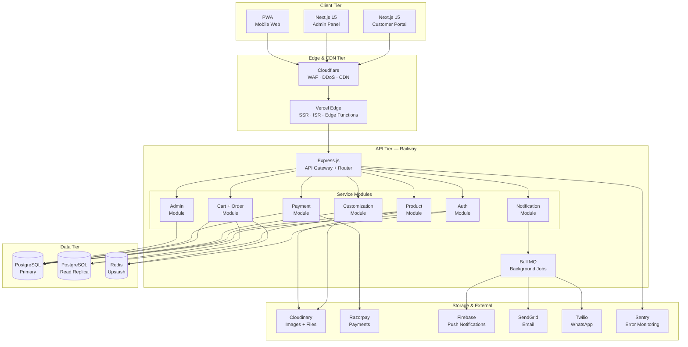
```mermaid
flowchart TB
    subgraph CLIENT["Client Tier"]
        direction LR
        WEB["Next.js 15\nCustomer Portal"]
        ADMIN["Next.js 15\nAdmin Panel"]
        PWA["PWA\nMobile Web"]
    end

    subgraph EDGE["Edge & CDN Tier"]
        CF["Cloudflare\nWAF · DDoS · CDN"]
        VE["Vercel Edge\nSSR · ISR · Edge Functions"]
    end

    subgraph API["API Tier — Railway"]
        GW["Express.js\nAPI Gateway + Router"]
        subgraph MODULES["Service Modules"]
            AUTH["Auth\nModule"]
            PROD["Product\nModule"]
            CUST_MOD["Customization\nModule"]
            CART_ORD["Cart + Order\nModule"]
            PAY["Payment\nModule"]
            NOTIFY["Notification\nModule"]
            ADMIN_MOD["Admin\nModule"]
        end
        JOBS["Bull MQ\nBackground Jobs"]
    end

    subgraph DATA["Data Tier"]
        PG[("PostgreSQL\nPrimary")]
        PGR[("PostgreSQL\nRead Replica")]
        REDIS[("Redis\nUpstash")]
    end

    subgraph STORAGE["Storage & External"]
        CLD["Cloudinary\nImages + Files"]
        RZP["Razorpay\nPayments"]
        FCM["Firebase\nPush Notifications"]
        SG["SendGrid\nEmail"]
        TWA["Twilio\nWhatsApp"]
        SENTRY["Sentry\nError Monitoring"]
    end

    WEB & ADMIN & PWA --> CF
    CF --> VE
    VE --> GW
    GW --> AUTH & PROD & CUST_MOD & CART_ORD & PAY & NOTIFY & ADMIN_MOD
    AUTH & PROD & CUST_MOD & CART_ORD & PAY & ADMIN_MOD --> PG
    PROD & CART_ORD --> PGR
    AUTH & CART_ORD --> REDIS
    CUST_MOD & PROD --> CLD
    PAY --> RZP
    JOBS --> FCM & SG & TWA
    NOTIFY --> JOBS
    GW --> SENTRY
```

---

## 8. Detailed Component Architecture

### 8.1 Frontend Architecture

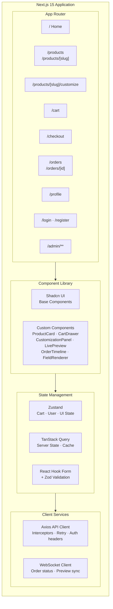
```mermaid
flowchart TB
    subgraph NEXTJS["Next.js 15 Application"]
        direction TB
        subgraph ROUTING["App Router"]
            HOME["/ Home"]
            PRODUCTS["/products\n/products/[slug]"]
            CUSTOMIZE["/products/[slug]/customize"]
            CART_PAGE["/cart"]
            CHECKOUT_PAGE["/checkout"]
            ORDERS_PAGE["/orders\n/orders/[id]"]
            PROFILE_PAGE["/profile"]
            AUTH_PAGES["/login · /register"]
            ADMIN_PAGES["/admin/**"]
        end

        subgraph COMPONENTS["Component Library"]
            direction LR
            UI["Shadcn UI\nBase Components"]
            CUSTOM_UI["Custom Components\nProductCard · CartDrawer\nCustomizationPanel · LivePreview\nOrderTimeline · FieldRenderer"]
        end

        subgraph STATE["State Management"]
            ZUSTAND["Zustand\nCart · User · UI State"]
            RQ["TanStack Query\nServer State · Cache"]
            FORM["React Hook Form\n+ Zod Validation"]
        end

        subgraph SERVICES["Client Services"]
            API_CLIENT["Axios API Client\nInterceptors · Retry · Auth headers"]
            WS_CLIENT["WebSocket Client\nOrder status · Preview sync"]
        end
    end

    ROUTING --> COMPONENTS
    COMPONENTS --> STATE
    STATE --> SERVICES
```

### 8.2 Backend Module Architecture

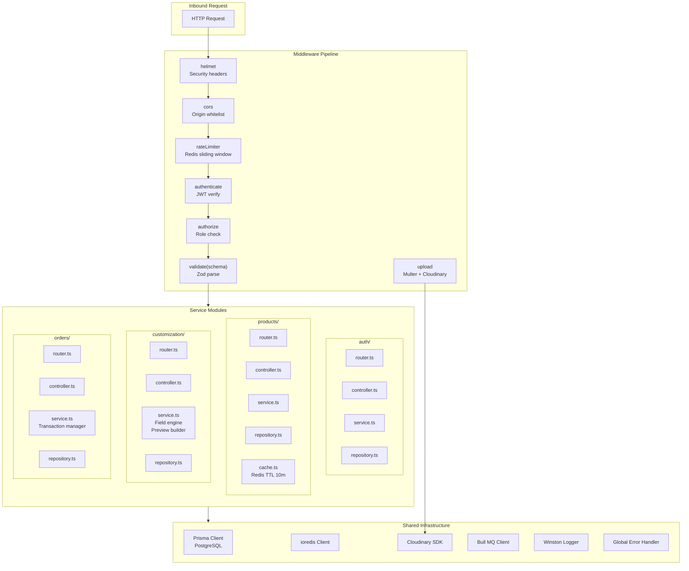
```mermaid
flowchart TB
    subgraph REQUEST["Inbound Request"]
        REQ["HTTP Request"]
    end

    subgraph MIDDLEWARE["Middleware Pipeline"]
        direction LR
        HELMET["helmet\nSecurity headers"]
        CORS_MW["cors\nOrigin whitelist"]
        RL["rateLimiter\nRedis sliding window"]
        AUTH_MW["authenticate\nJWT verify"]
        RBAC["authorize\nRole check"]
        VALIDATE["validate(schema)\nZod parse"]
        UPLOAD_MW["upload\nMulter + Cloudinary"]
    end

    subgraph MODULES_DETAIL["Service Modules"]
        direction TB
        subgraph AUTH_MOD["auth/"]
            AUTH_R["router.ts"]
            AUTH_C["controller.ts"]
            AUTH_S["service.ts"]
            AUTH_REPO["repository.ts"]
        end
        subgraph PROD_MOD["products/"]
            PROD_R["router.ts"]
            PROD_C["controller.ts"]
            PROD_S["service.ts"]
            PROD_REPO["repository.ts"]
            PROD_CACHE["cache.ts\nRedis TTL 10m"]
        end
        subgraph CUSTOM_MOD_DETAIL["customization/"]
            CUST_R["router.ts"]
            CUST_C["controller.ts"]
            CUST_S["service.ts\nField engine\nPreview builder"]
            CUST_REPO["repository.ts"]
        end
        subgraph ORDER_MOD["orders/"]
            ORD_R["router.ts"]
            ORD_C["controller.ts"]
            ORD_S["service.ts\nTransaction manager"]
            ORD_REPO["repository.ts"]
        end
    end

    subgraph SHARED["Shared Infrastructure"]
        PRISMA_CLIENT["Prisma Client\nPostgreSQL"]
        REDIS_CLIENT["ioredis Client"]
        CLOUDINARY_SDK["Cloudinary SDK"]
        BULL_CLIENT["Bull MQ Client"]
        LOGGER["Winston Logger"]
        ERROR_H["Global Error Handler"]
    end

    REQ --> HELMET --> CORS_MW --> RL --> AUTH_MW --> RBAC --> VALIDATE --> MODULES_DETAIL
    MODULES_DETAIL --> SHARED
    UPLOAD_MW --> CLOUDINARY_SDK
```

### 8.3 Dynamic Customization Engine Architecture

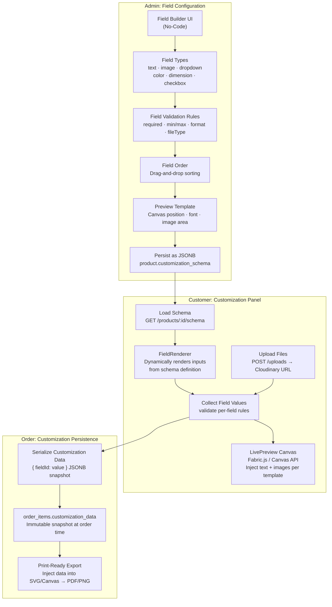
```mermaid
flowchart TB
    subgraph ADMIN_SIDE["Admin: Field Configuration"]
        FB["Field Builder UI\n(No-Code)"]
        FT["Field Types\ntext · image · dropdown\ncolor · dimension · checkbox"]
        FV["Field Validation Rules\nrequired · min/max · format · fileType"]
        FO["Field Order\nDrag-and-drop sorting"]
        PT["Preview Template\nCanvas position · font · image area"]
        FB --> FT --> FV --> FO --> PT
        PT --> SAVE_SCHEMA["Persist as JSONB\nproduct.customization_schema"]
    end

    subgraph CUSTOMER_SIDE["Customer: Customization Panel"]
        LOAD_SCHEMA["Load Schema\nGET /products/:id/schema"]
        RENDER_FIELDS["FieldRenderer\nDynamically renders inputs\nfrom schema definition"]
        COLLECT_DATA["Collect Field Values\nvalidate per-field rules"]
        UPLOAD_FILES["Upload Files\nPOST /uploads → Cloudinary URL"]
        PREVIEW["LivePreview Canvas\nFabric.js / Canvas API\nInject text + images per template"]
        LOAD_SCHEMA --> RENDER_FIELDS --> COLLECT_DATA
        UPLOAD_FILES --> COLLECT_DATA
        COLLECT_DATA --> PREVIEW
    end

    subgraph ORDER_SIDE["Order: Customization Persistence"]
        SERIALIZE["Serialize Customization Data\n{ fieldId: value } JSONB snapshot"]
        ORDER_ITEM["order_items.customization_data\nImmutable snapshot at order time"]
        PRINT_EXPORT["Print-Ready Export\nInject data into SVG/Canvas → PDF/PNG"]
        SERIALIZE --> ORDER_ITEM --> PRINT_EXPORT
    end

    SAVE_SCHEMA --> LOAD_SCHEMA
    COLLECT_DATA --> SERIALIZE
```

---

## 9. Database ER Diagram

```mermaid
erDiagram
    users {
        uuid id PK
        string email UK
        string phone UK
        string password_hash
        enum role
        boolean is_verified
        boolean is_active
        timestamptz created_at
        timestamptz updated_at
    }

    addresses {
        uuid id PK
        uuid user_id FK
        string full_name
        string phone
        string line1
        string line2
        string city
        string state
        string pincode
        boolean is_default
    }

    categories {
        uuid id PK
        uuid parent_id FK
        string name
        string slug UK
        string image_url
        int sort_order
        boolean is_active
    }

    products {
        uuid id PK
        uuid category_id FK
        string name
        string slug UK
        text description
        decimal base_price
        string sku UK
        boolean is_customizable
        jsonb customization_schema
        jsonb images
        boolean is_active
        timestamptz created_at
    }

    product_variants {
        uuid id PK
        uuid product_id FK
        string name
        jsonb options
        decimal price_delta
        int stock
        string sku UK
        boolean is_active
    }

    design_templates {
        uuid id PK
        uuid product_id FK
        string name
        jsonb canvas_config
        int width_px
        int height_px
    }

    user_designs {
        uuid id PK
        uuid user_id FK
        uuid product_id FK
        string name
        jsonb customization_data
        string preview_url
        timestamptz created_at
    }

    carts {
        uuid id PK
        uuid user_id FK UK
        timestamptz updated_at
    }

    cart_items {
        uuid id PK
        uuid cart_id FK
        uuid variant_id FK
        int quantity
        jsonb customization_data
        decimal unit_price
    }

    coupons {
        uuid id PK
        string code UK
        enum type
        decimal value
        decimal min_order_value
        int usage_limit
        int used_count
        timestamptz valid_from
        timestamptz valid_to
        boolean is_active
    }

    orders {
        uuid id PK
        string order_number UK
        uuid user_id FK
        uuid address_id FK
        uuid coupon_id FK
        enum status
        decimal subtotal
        decimal discount_amount
        decimal shipping_charge
        decimal total_amount
        text customer_notes
        timestamptz created_at
    }

    order_items {
        uuid id PK
        uuid order_id FK
        uuid variant_id FK
        int quantity
        decimal unit_price
        jsonb customization_data
        string preview_url
    }

    payments {
        uuid id PK
        uuid order_id FK UK
        string razorpay_order_id UK
        string razorpay_payment_id
        string razorpay_signature
        decimal amount
        enum status
        string method
        string currency
        timestamptz captured_at
    }

    reviews {
        uuid id PK
        uuid user_id FK
        uuid product_id FK
        uuid order_id FK
        int rating
        text body
        boolean is_verified_purchase
        boolean is_approved
        timestamptz created_at
    }

    notifications {
        uuid id PK
        uuid user_id FK
        string title
        text body
        string type
        string entity_type
        uuid entity_id
        boolean is_read
        timestamptz created_at
    }

    activity_logs {
        uuid id PK
        uuid user_id FK
        string action
        string entity_type
        uuid entity_id
        jsonb metadata
        string ip_address
        timestamptz created_at
    }

    users ||--o{ addresses : "has"
    users ||--o{ user_designs : "saves"
    users ||--|| carts : "has"
    users ||--o{ orders : "places"
    users ||--o{ reviews : "writes"
    users ||--o{ notifications : "receives"
    categories ||--o{ categories : "parent of"
    categories ||--o{ products : "contains"
    products ||--o{ product_variants : "has"
    products ||--o{ design_templates : "uses"
    products ||--o{ reviews : "receives"
    carts ||--o{ cart_items : "contains"
    cart_items }o--|| product_variants : "references"
    orders ||--o{ order_items : "contains"
    orders ||--|| payments : "has"
    order_items }o--|| product_variants : "references"
    coupons ||--o{ orders : "applied to"
    addresses ||--o{ orders : "delivered to"
```

---

## 10. PostgreSQL Schema Design

### 10.1 Prisma Schema (Abbreviated)

```
// ─────────────────────────────────────────────
// ENUMS
// ─────────────────────────────────────────────

enum UserRole        { CUSTOMER  ADMIN  SUPER_ADMIN }
enum OrderStatus     { PENDING  PAYMENT_CONFIRMED  IN_PRODUCTION
                       QUALITY_CHECK  SHIPPED  DELIVERED  CANCELLED  REFUNDED }
enum PaymentStatus   { CREATED  CAPTURED  FAILED  REFUNDED }
enum CouponType      { PERCENTAGE  FLAT_AMOUNT  FREE_SHIPPING }

// ─────────────────────────────────────────────
// USERS & ACCOUNTS
// ─────────────────────────────────────────────

model User {
  id              String    @id @default(uuid())
  email           String    @unique
  phone           String?   @unique
  passwordHash    String
  name            String
  avatarUrl       String?
  role            UserRole  @default(CUSTOMER)
  isVerified      Boolean   @default(false)
  isActive        Boolean   @default(true)
  fcmToken        String?
  createdAt       DateTime  @default(now())
  updatedAt       DateTime  @updatedAt
  addresses       Address[]
  cart            Cart?
  orders          Order[]
  designs         UserDesign[]
  reviews         Review[]
  notifications   Notification[]
  @@index([email])
  @@index([phone])
}

model Address {
  id          String   @id @default(uuid())
  userId      String
  user        User     @relation(fields: [userId], references: [id])
  fullName    String
  phone       String
  line1       String
  line2       String?
  city        String
  state       String
  pincode     String
  isDefault   Boolean  @default(false)
  orders      Order[]
}

// ─────────────────────────────────────────────
// CATALOG
// ─────────────────────────────────────────────

model Category {
  id          String     @id @default(uuid())
  parentId    String?
  parent      Category?  @relation("SubCategories", fields: [parentId], references: [id])
  children    Category[] @relation("SubCategories")
  name        String
  slug        String     @unique
  imageUrl    String?
  sortOrder   Int        @default(0)
  isActive    Boolean    @default(true)
  products    Product[]
}

model Product {
  id                  String             @id @default(uuid())
  categoryId          String
  category            Category           @relation(fields: [categoryId], references: [id])
  name                String
  slug                String             @unique
  description         String
  basePriceInPaise    Int
  sku                 String             @unique
  isCustomizable      Boolean            @default(false)
  customizationSchema Json?              // FieldDefinition[]
  images              Json               // string[]
  tags                String[]
  isActive            Boolean            @default(true)
  createdAt           DateTime           @default(now())
  updatedAt           DateTime           @updatedAt
  variants            ProductVariant[]
  designTemplates     DesignTemplate[]
  reviews             Review[]
  cartItems           CartItem[]
  @@index([categoryId])
  @@index([slug])
  @@index([isActive])
}

model ProductVariant {
  id              String      @id @default(uuid())
  productId       String
  product         Product     @relation(fields: [productId], references: [id])
  name            String
  options         Json        // { size: "A4", color: "white" }
  priceDeltaPaise Int         @default(0)
  stock           Int         @default(0)
  sku             String      @unique
  isActive        Boolean     @default(true)
  cartItems       CartItem[]
  orderItems      OrderItem[]
}

// ─────────────────────────────────────────────
// CUSTOMIZATION
// ─────────────────────────────────────────────

// customizationSchema shape (stored as JSONB):
// FieldDefinition {
//   id: string (uuid)
//   type: 'text' | 'textarea' | 'number' | 'image' | 'dropdown'
//         | 'checkbox' | 'radio' | 'color' | 'dimension'
//   label: string
//   placeholder?: string
//   required: boolean
//   order: number
//   validation?: {
//     minLength?: number, maxLength?: number,
//     min?: number, max?: number,
//     allowedFormats?: string[], maxSizeMB?: number
//     options?: { label: string, value: string }[]
//   }
//   previewConfig?: {
//     canvasX: number, canvasY: number,
//     maxWidth: number, maxHeight: number,
//     fontSize?: number, fontFamily?: string, color?: string
//   }
// }

model DesignTemplate {
  id           String   @id @default(uuid())
  productId    String
  product      Product  @relation(fields: [productId], references: [id])
  name         String
  canvasConfig Json     // background, overlay, dimensions
  widthPx      Int
  heightPx     Int
}

model UserDesign {
  id                String   @id @default(uuid())
  userId            String
  user              User     @relation(fields: [userId], references: [id])
  productId         String
  name              String
  customizationData Json
  previewUrl        String?
  createdAt         DateTime @default(now())
}

// ─────────────────────────────────────────────
// CART & ORDERS
// ─────────────────────────────────────────────

model Cart {
  id        String     @id @default(uuid())
  userId    String     @unique
  user      User       @relation(fields: [userId], references: [id])
  items     CartItem[]
  updatedAt DateTime   @updatedAt
}

model CartItem {
  id                String         @id @default(uuid())
  cartId            String
  cart              Cart           @relation(fields: [cartId], references: [id])
  variantId         String
  variant           ProductVariant @relation(fields: [variantId], references: [id])
  quantity          Int
  customizationData Json?
  unitPriceInPaise  Int
  @@unique([cartId, variantId])
}

model Order {
  id                String      @id @default(uuid())
  orderNumber       String      @unique
  userId            String
  user              User        @relation(fields: [userId], references: [id])
  addressId         String
  address           Address     @relation(fields: [addressId], references: [id])
  couponId          String?
  coupon            Coupon?     @relation(fields: [couponId], references: [id])
  status            OrderStatus @default(PENDING)
  subtotalPaise     Int
  discountPaise     Int         @default(0)
  shippingPaise     Int         @default(0)
  totalPaise        Int
  customerNotes     String?
  createdAt         DateTime    @default(now())
  updatedAt         DateTime    @updatedAt
  items             OrderItem[]
  payment           Payment?
  @@index([userId])
  @@index([status])
  @@index([createdAt])
}

model OrderItem {
  id                String         @id @default(uuid())
  orderId           String
  order             Order          @relation(fields: [orderId], references: [id])
  variantId         String
  variant           ProductVariant @relation(fields: [variantId], references: [id])
  quantity          Int
  unitPriceInPaise  Int
  customizationData Json?          // Immutable snapshot
  previewUrl        String?
}

// ─────────────────────────────────────────────
// PAYMENTS & COUPONS
// ─────────────────────────────────────────────

model Payment {
  id                 String        @id @default(uuid())
  orderId            String        @unique
  order              Order         @relation(fields: [orderId], references: [id])
  razorpayOrderId    String        @unique
  razorpayPaymentId  String?
  razorpaySignature  String?
  amountInPaise      Int
  currency           String        @default("INR")
  status             PaymentStatus @default(CREATED)
  method             String?
  capturedAt         DateTime?
  createdAt          DateTime      @default(now())
}

model Coupon {
  id              String     @id @default(uuid())
  code            String     @unique
  type            CouponType
  value           Decimal
  minOrderPaise   Int?
  usageLimit      Int?
  usedCount       Int        @default(0)
  validFrom       DateTime
  validTo         DateTime
  isActive        Boolean    @default(true)
  orders          Order[]
}
```

### 10.2 Critical Indexes

```sql
-- Full-text search on products
CREATE INDEX idx_products_fts ON products 
  USING gin(to_tsvector('english', name || ' ' || description));

-- Order lookups (most frequent admin query)
CREATE INDEX idx_orders_status_created ON orders(status, created_at DESC);

-- Inventory check (prevent oversell)
CREATE UNIQUE INDEX idx_variant_sku ON product_variants(sku);
CREATE INDEX idx_variant_stock ON product_variants(product_id, stock) 
  WHERE stock > 0;

-- Cart performance
CREATE UNIQUE INDEX idx_cart_item_unique ON cart_items(cart_id, variant_id);

-- Analytics rollup queries
CREATE INDEX idx_payments_captured ON payments(captured_at) 
  WHERE status = 'CAPTURED';

-- Notification fan-out
CREATE INDEX idx_notifications_user_unread ON notifications(user_id, created_at DESC) 
  WHERE is_read = false;
```

---

## 11. API Architecture

### 11.1 API Design Principles

- RESTful resource-based URLs
- Versioned: `/api/v1/`
- Standard response envelope: `{ success, data, error, meta }`
- Pagination: cursor-based for feeds, offset for admin grids
- Idempotency keys required on all mutating payment calls
- Rate-limit headers on every response: `X-RateLimit-Limit`, `X-RateLimit-Remaining`

### 11.2 Complete API Endpoint Map

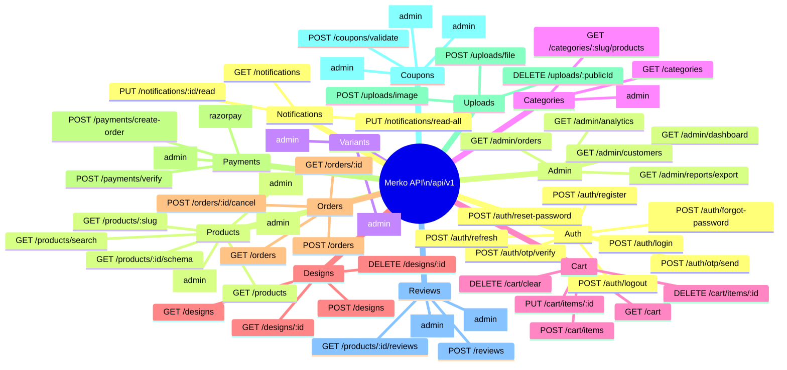
```mermaid
mindmap
  root((Merko API\n/api/v1))
    Auth
      POST /auth/register
      POST /auth/login
      POST /auth/otp/send
      POST /auth/otp/verify
      POST /auth/refresh
      POST /auth/logout
      POST /auth/forgot-password
      POST /auth/reset-password
    Products
      GET /products
      GET /products/:slug
      GET /products/search
      GET /products/:id/schema
      POST /products [admin]
      PUT /products/:id [admin]
      DELETE /products/:id [admin]
    Variants
      POST /products/:id/variants [admin]
      PUT /variants/:id [admin]
    Categories
      GET /categories
      GET /categories/:slug/products
      POST /categories [admin]
    Cart
      GET /cart
      POST /cart/items
      PUT /cart/items/:id
      DELETE /cart/items/:id
      DELETE /cart/clear
    Designs
      GET /designs
      POST /designs
      GET /designs/:id
      DELETE /designs/:id
    Orders
      POST /orders
      GET /orders
      GET /orders/:id
      POST /orders/:id/cancel
    Payments
      POST /payments/create-order
      POST /payments/verify
      POST /payments/webhook [razorpay]
      POST /payments/:id/refund [admin]
    Uploads
      POST /uploads/image
      POST /uploads/file
      DELETE /uploads/:publicId
    Coupons
      POST /coupons/validate
      POST /coupons [admin]
      GET /coupons [admin]
      PUT /coupons/:id [admin]
    Reviews
      GET /products/:id/reviews
      POST /reviews
      PUT /reviews/:id [admin]
      DELETE /reviews/:id [admin]
    Notifications
      GET /notifications
      PUT /notifications/:id/read
      PUT /notifications/read-all
    Admin
      GET /admin/dashboard
      GET /admin/orders
      GET /admin/customers
      GET /admin/analytics
      GET /admin/reports/export
```

### 11.3 Request / Response Flow

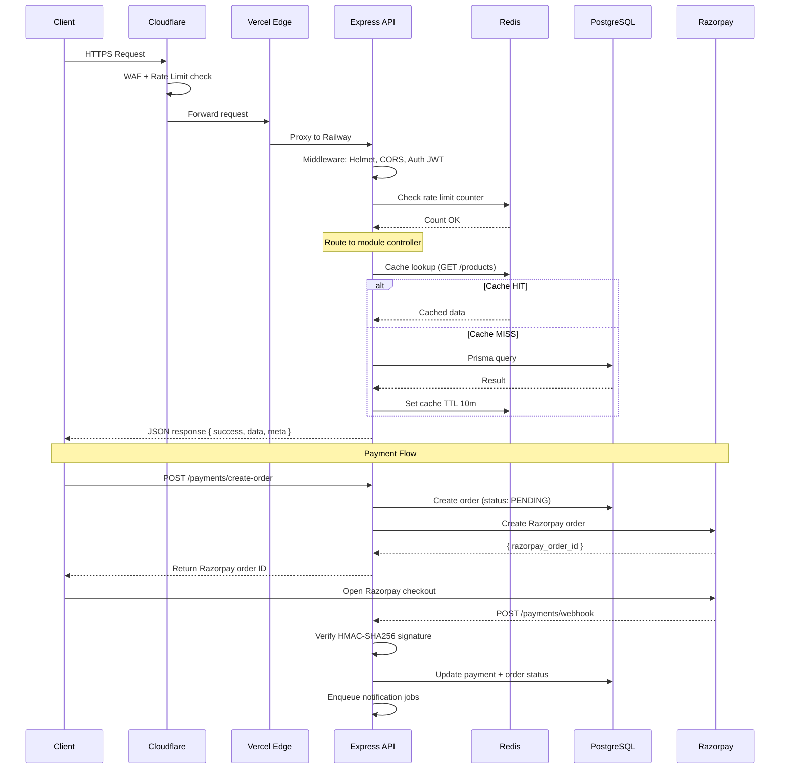
```mermaid
sequenceDiagram
    participant C as Client
    participant CF as Cloudflare
    participant VE as Vercel Edge
    participant API as Express API
    participant REDIS as Redis
    participant DB as PostgreSQL
    participant RZP as Razorpay

    C->>CF: HTTPS Request
    CF->>CF: WAF + Rate Limit check
    CF->>VE: Forward request
    VE->>API: Proxy to Railway
    
    API->>API: Middleware: Helmet, CORS, Auth JWT
    API->>REDIS: Check rate limit counter
    REDIS-->>API: Count OK
    
    Note over API: Route to module controller
    
    API->>REDIS: Cache lookup (GET /products)
    alt Cache HIT
        REDIS-->>API: Cached data
    else Cache MISS
        API->>DB: Prisma query
        DB-->>API: Result
        API->>REDIS: Set cache TTL 10m
    end
    
    API-->>C: JSON response { success, data, meta }

    Note over C,RZP: Payment Flow
    C->>API: POST /payments/create-order
    API->>DB: Create order (status: PENDING)
    API->>RZP: Create Razorpay order
    RZP-->>API: { razorpay_order_id }
    API-->>C: Return Razorpay order ID
    C->>RZP: Open Razorpay checkout
    RZP-->>API: POST /payments/webhook
    API->>API: Verify HMAC-SHA256 signature
    API->>DB: Update payment + order status
    API->>API: Enqueue notification jobs
```

---

## 12. Security Architecture

### 12.1 Security Layers


```mermaid
flowchart TB
    subgraph LAYER1["Layer 1: Edge Security (Cloudflare)"]
        DDoS["DDoS Protection"]
        WAF["Web Application Firewall\nOWASP Top 10 rules"]
        BOTM["Bot Management"]
        CF_RL["Rate Limiting\nIP-based"]
    end

    subgraph LAYER2["Layer 2: Transport Security"]
        TLS["TLS 1.3\nHSTS max-age=31536000"]
        CSP["Content-Security-Policy\nstrict-dynamic"]
        HPKP["Certificate Pinning\nCloudflare managed"]
    end

    subgraph LAYER3["Layer 3: Application Security"]
        HELMET_SEC["Helmet.js\nX-Frame-Options: DENY\nX-Content-Type-Options: nosniff\nReferrer-Policy: strict-origin"]
        CORS_SEC["CORS\nExplicit allowlist\nCredentials: same-origin only"]
        APP_RL["App Rate Limiting\nRedis sliding window\n100/min general · 5/min auth"]
    end

    subgraph LAYER4["Layer 4: Authentication & Authorization"]
        JWT_SEC["JWT Access Tokens\nHS256 · 15-min expiry\nhttpOnly cookie only"]
        REFRESH["Refresh Tokens\n7-day · Redis-backed\nRotate on every use"]
        RBAC_SEC["RBAC Middleware\ncustomer | admin | super_admin"]
        OTP_SEC["OTP\n6-digit · 5-min TTL\nMax 3 attempts → lockout"]
    end

    subgraph LAYER5["Layer 5: Data Security"]
        BCRYPT["bcrypt\ncost=12\npassword hashing"]
        PRISMA_SEC["Prisma ORM\nParameterized queries\nNo raw SQL in business logic"]
        ZOD_SEC["Zod Validation\nAll inputs validated\nbefore controller"]
        FILE_SEC["File Upload\nMIME whitelist\nMagic byte check\nSize limit 5MB\nCloudinary virus scan"]
        PAYMENT_SEC["Payment Security\nRazorpay hosted checkout\nHMAC-SHA256 webhook verify\nNo card data stored"]
    end

    LAYER1 --> LAYER2 --> LAYER3 --> LAYER4 --> LAYER5
```

### 12.2 Authentication Token Flow

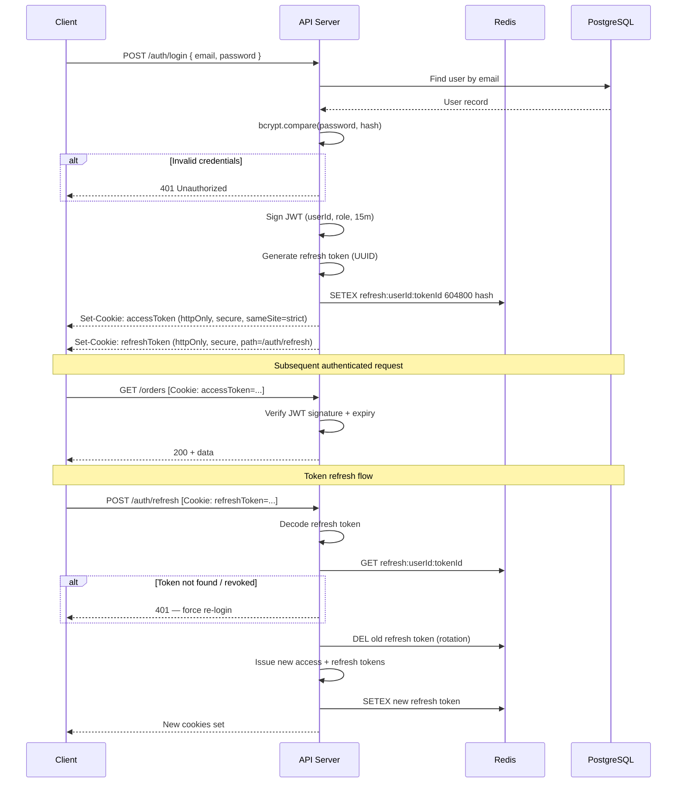
```mermaid
sequenceDiagram
    participant C as Client
    participant API as API Server
    participant REDIS as Redis
    participant DB as PostgreSQL

    C->>API: POST /auth/login { email, password }
    API->>DB: Find user by email
    DB-->>API: User record
    API->>API: bcrypt.compare(password, hash)
    
    alt Invalid credentials
        API-->>C: 401 Unauthorized
    end
    
    API->>API: Sign JWT (userId, role, 15m)
    API->>API: Generate refresh token (UUID)
    API->>REDIS: SETEX refresh:userId:tokenId 604800 hash
    API-->>C: Set-Cookie: accessToken (httpOnly, secure, sameSite=strict)
    API-->>C: Set-Cookie: refreshToken (httpOnly, secure, path=/auth/refresh)

    Note over C,DB: Subsequent authenticated request
    C->>API: GET /orders [Cookie: accessToken=...]
    API->>API: Verify JWT signature + expiry
    API-->>C: 200 + data

    Note over C,DB: Token refresh flow
    C->>API: POST /auth/refresh [Cookie: refreshToken=...]
    API->>API: Decode refresh token
    API->>REDIS: GET refresh:userId:tokenId
    
    alt Token not found / revoked
        API-->>C: 401 — force re-login
    end
    
    API->>REDIS: DEL old refresh token (rotation)
    API->>API: Issue new access + refresh tokens
    API->>REDIS: SETEX new refresh token
    API-->>C: New cookies set
```

---

## 13. File Storage Architecture

### 13.1 Upload Flow

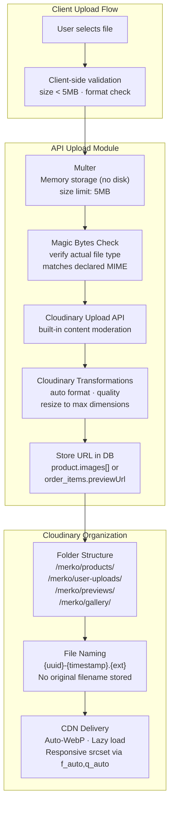
```mermaid
flowchart TB
    subgraph CLIENT_UPLOAD["Client Upload Flow"]
        UC["User selects file"]
        VALIDATE_CLIENT["Client-side validation\nsize < 5MB · format check"]
        UC --> VALIDATE_CLIENT
    end

    subgraph API_UPLOAD["API Upload Module"]
        MULTER["Multer\nMemory storage (no disk)\nsize limit: 5MB"]
        MAGIC["Magic Bytes Check\nverify actual file type\nmatches declared MIME"]
        SCAN["Cloudinary Upload API\nbuilt-in content moderation"]
        TRANSFORM["Cloudinary Transformations\nauto format · quality\nresize to max dimensions"]
        STORE["Store URL in DB\nproduct.images[] or\norder_items.previewUrl"]
        MULTER --> MAGIC --> SCAN --> TRANSFORM --> STORE
    end

    subgraph CLOUDINARY["Cloudinary Organization"]
        FOLDERS["Folder Structure\n/merko/products/\n/merko/user-uploads/\n/merko/previews/\n/merko/gallery/"]
        NAMING["File Naming\n{uuid}-{timestamp}.{ext}\nNo original filename stored"]
        CDN_SERVE["CDN Delivery\nAuto-WebP · Lazy load\nResponsive srcset via f_auto,q_auto"]
    end

    VALIDATE_CLIENT --> MULTER
    STORE --> FOLDERS
    FOLDERS --> NAMING
    NAMING --> CDN_SERVE
```

### 13.2 Cloudinary Folder Structure & Policy

| Folder | Content | Access | Retention |
|---|---|---|---|
| `/merko/products/` | Product catalog images | Public | Indefinite |
| `/merko/user-uploads/` | Customer customization files | Signed URL only | 1 year |
| `/merko/previews/` | Generated design previews | Public (UUID in URL) | 2 years |
| `/merko/gallery/` | Admin portfolio uploads | Public | Indefinite |
| `/merko/temp/` | Processing intermediates | Private | 24 hours (auto-purge) |

---

## 14. Payment Architecture

### 14.1 Payment Lifecycle

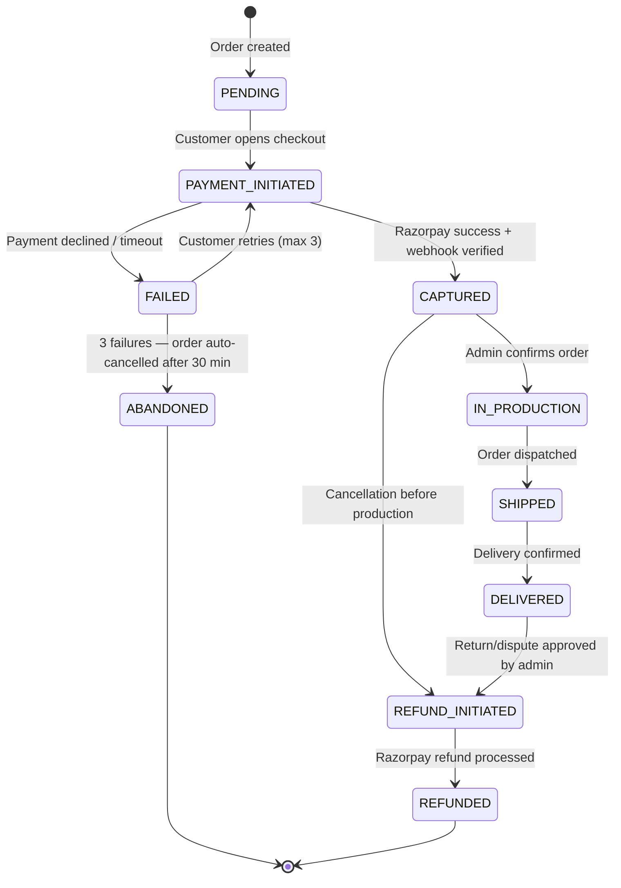
```mermaid
stateDiagram-v2
    [*] --> PENDING : Order created
    PENDING --> PAYMENT_INITIATED : Customer opens checkout
    PAYMENT_INITIATED --> CAPTURED : Razorpay success + webhook verified
    PAYMENT_INITIATED --> FAILED : Payment declined / timeout
    FAILED --> PAYMENT_INITIATED : Customer retries (max 3)
    FAILED --> ABANDONED : 3 failures — order auto-cancelled after 30 min
    CAPTURED --> IN_PRODUCTION : Admin confirms order
    IN_PRODUCTION --> SHIPPED : Order dispatched
    SHIPPED --> DELIVERED : Delivery confirmed
    CAPTURED --> REFUND_INITIATED : Cancellation before production
    DELIVERED --> REFUND_INITIATED : Return/dispute approved by admin
    REFUND_INITIATED --> REFUNDED : Razorpay refund processed
    ABANDONED --> [*]
    REFUNDED --> [*]
```

### 14.2 Webhook Security Flow

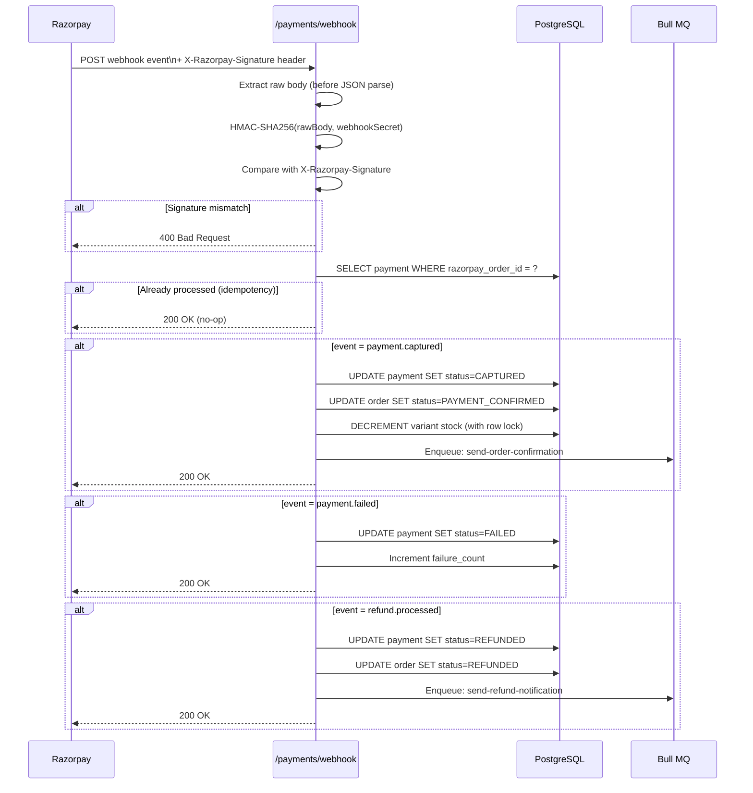
```mermaid
sequenceDiagram
    participant RZP as Razorpay
    participant API as /payments/webhook
    participant DB as PostgreSQL
    participant QUEUE as Bull MQ

    RZP->>API: POST webhook event\n+ X-Razorpay-Signature header

    API->>API: Extract raw body (before JSON parse)
    API->>API: HMAC-SHA256(rawBody, webhookSecret)
    API->>API: Compare with X-Razorpay-Signature

    alt Signature mismatch
        API-->>RZP: 400 Bad Request
    end

    API->>DB: SELECT payment WHERE razorpay_order_id = ?
    
    alt Already processed (idempotency)
        API-->>RZP: 200 OK (no-op)
    end

    alt event = payment.captured
        API->>DB: UPDATE payment SET status=CAPTURED
        API->>DB: UPDATE order SET status=PAYMENT_CONFIRMED
        API->>DB: DECREMENT variant stock (with row lock)
        API->>QUEUE: Enqueue: send-order-confirmation
        API-->>RZP: 200 OK
    end

    alt event = payment.failed
        API->>DB: UPDATE payment SET status=FAILED
        API->>DB: Increment failure_count
        API-->>RZP: 200 OK
    end

    alt event = refund.processed
        API->>DB: UPDATE payment SET status=REFUNDED
        API->>DB: UPDATE order SET status=REFUNDED
        API->>QUEUE: Enqueue: send-refund-notification
        API-->>RZP: 200 OK
    end
```

---

## 15. Notification Architecture

### 15.1 Notification Topology

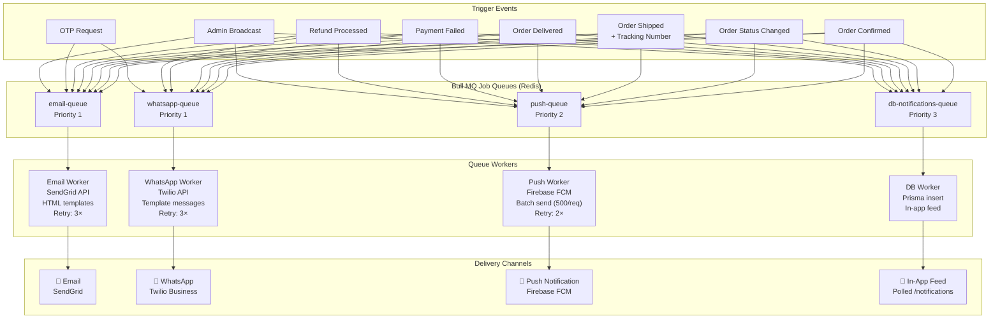
```mermaid
flowchart TB
    subgraph TRIGGERS["Trigger Events"]
        T1["Order Confirmed"]
        T2["Order Status Changed"]
        T3["Order Shipped\n+ Tracking Number"]
        T4["Order Delivered"]
        T5["Payment Failed"]
        T6["Refund Processed"]
        T7["OTP Request"]
        T8["Admin Broadcast"]
    end

    subgraph QUEUE["Bull MQ Job Queues (Redis)"]
        Q_EMAIL["email-queue\nPriority 1"]
        Q_WA["whatsapp-queue\nPriority 1"]
        Q_PUSH["push-queue\nPriority 2"]
        Q_DB["db-notifications-queue\nPriority 3"]
    end

    subgraph WORKERS["Queue Workers"]
        W_EMAIL["Email Worker\nSendGrid API\nHTML templates\nRetry: 3×"]
        W_WA["WhatsApp Worker\nTwilio API\nTemplate messages\nRetry: 3×"]
        W_PUSH["Push Worker\nFirebase FCM\nBatch send (500/req)\nRetry: 2×"]
        W_DB["DB Worker\nPrisma insert\nIn-app feed"]
    end

    subgraph DELIVERY["Delivery Channels"]
        EMAIL["📧 Email\nSendGrid"]
        WHATSAPP["💬 WhatsApp\nTwilio Business"]
        PUSH["🔔 Push Notification\nFirebase FCM"]
        INAPP["🔴 In-App Feed\nPolled /notifications"]
    end

    T1 & T2 & T3 & T4 & T5 & T6 --> Q_EMAIL & Q_WA & Q_PUSH & Q_DB
    T7 --> Q_EMAIL & Q_WA
    T8 --> Q_EMAIL & Q_PUSH & Q_DB

    Q_EMAIL --> W_EMAIL --> EMAIL
    Q_WA --> W_WA --> WHATSAPP
    Q_PUSH --> W_PUSH --> PUSH
    Q_DB --> W_DB --> INAPP
```

### 15.2 Notification Templates

| Event | Email | WhatsApp | Push |
|---|:---:|:---:|:---:|
| Registration OTP | ✓ | ✓ | ✗ |
| Order Confirmed | ✓ | ✓ | ✓ |
| In Production | ✓ | ✓ | ✓ |
| Shipped | ✓ | ✓ | ✓ |
| Delivered | ✓ | ✓ | ✓ |
| Payment Failed | ✓ | ✓ | ✓ |
| Refund Processed | ✓ | ✓ | ✓ |
| Coupon Alert | ✓ | ✗ | ✓ |
| Review Request (+3 days) | ✓ | ✗ | ✓ |

---

## 16. Deployment Architecture

### 16.1 Infrastructure Overview

```mermaid
flowchart TB
    subgraph INTERNET["Internet"]
        USER["End Users\nBrowser + Mobile"]
    end

    subgraph EDGE_LAYER["Cloudflare Edge (Global)"]
        CF_CDN["CDN\nStatic assets cached globally"]
        CF_WAF2["WAF\nOWASP rules + custom"]
        CF_RL2["Rate Limiting\nIP-based sliding window"]
        CF_DNS["DNS\nAutomatic failover"]
    end

    subgraph VERCEL["Vercel (Frontend)"]
        VE_EDGE["Edge Network\n40+ PoPs worldwide"]
        VE_SSR["SSR Functions\nNext.js App Router"]
        VE_ISR["ISR Cache\nProduct pages 5-min revalidate"]
        VE_STATIC["Static Assets\nManifest, CSS, JS bundles"]
    end

    subgraph RAILWAY["Railway (Backend)"]
        subgraph API_CLUSTER["API Service"]
            API1["Node.js Pod 1"]
            API2["Node.js Pod 2"]
            API3["Node.js Pod 3"]
        end
        subgraph WORKER_CLUSTER["Worker Service"]
            W1["Bull MQ Worker 1\nEmail + WhatsApp"]
            W2["Bull MQ Worker 2\nPush + DB"]
        end
        PGB["PgBouncer\nConnection pooler\nPort 5432"]
        RW_PG[("PostgreSQL\nPrimary DB")]
        RW_PG_R[("PostgreSQL\nRead Replica")]
        RW_REDIS[("Redis\nUpstash managed")]
    end

    subgraph EXTERNAL_SERVICES["External Services"]
        CLD2["Cloudinary\nFile storage + CDN"]
        RZP2["Razorpay\nPayment gateway"]
        FCM2["Firebase FCM\nPush notifications"]
        SG2["SendGrid\nTransactional email"]
        TWA2["Twilio\nWhatsApp Business"]
        SENTRY2["Sentry\nError tracking"]
    end

    USER --> CF_CDN --> CF_WAF2 --> CF_RL2
    CF_RL2 --> VE_EDGE
    VE_EDGE --> VE_SSR --> API_CLUSTER
    VE_ISR --> VE_STATIC

    API_CLUSTER --> PGB --> RW_PG
    API_CLUSTER --> RW_PG_R
    API_CLUSTER --> RW_REDIS
    API_CLUSTER --> CLD2 & RZP2 & SENTRY2
    WORKER_CLUSTER --> RW_REDIS
    WORKER_CLUSTER --> FCM2 & SG2 & TWA2 & RW_PG
```

### 16.2 Environment Configuration

| Environment | Frontend | Backend | Database | Purpose |
|---|---|---|---|---|
| `development` | `localhost:3000` | `localhost:4000` | Local Docker PostgreSQL | Local dev |
| `preview` | Vercel PR preview | Railway PR env | Shared staging DB | PR review |
| `staging` | `staging.merko.in` | Railway staging | Staging DB (copy of prod schema) | QA + regression |
| `production` | `merko.in` | Railway production | Production DB | Live |

### 16.3 Docker Compose (Development)

```yaml
# High-level service definitions (no code, description only)
services:
  postgres:   Image: postgres:16, Port: 5432, Volume: pgdata
  redis:      Image: redis:7-alpine, Port: 6379
  api:        Build: ./apps/api, Port: 4000, Depends: postgres + redis
  worker:     Build: ./apps/api, CMD: worker, Depends: postgres + redis
```

---

## 17. Monitoring Architecture

### 17.1 Observability Stack

```mermaid
flowchart LR
    subgraph INSTRUMENTATION["Instrumentation"]
        APP_LOG["Winston Logger\nStructured JSON logs\nCorrelation IDs"]
        SENTRY_SDK["Sentry SDK\nError capture\nPerformance tracing"]
        VITALS["Next.js Speed Insights\nCore Web Vitals\nLCP · FID · CLS"]
        METRICS["Railway Metrics\nCPU · Memory · Requests\nP50 · P95 · P99"]
    end

    subgraph ALERTING["Alerting"]
        SENTRY_ALERT["Sentry Alerts\nError rate spike\nNew issue type"]
        RLY_ALERT["Railway Alerts\nCPU > 80%\nMemory > 85%\nDeploy failures"]
        CF_ALERT["Cloudflare Alerts\nOrigin errors > 1%\nDDoS detection"]
    end

    subgraph DASHBOARDS["Dashboards"]
        RAILWAY_DASH["Railway Dashboard\nService health\nDeploy history\nResource usage"]
        SENTRY_DASH["Sentry Dashboard\nError trends\nRelease tracking\nUser impact"]
        GA_DASH["Google Analytics 4\nUser journeys\nConversion funnel\nProduct views"]
    end

    subgraph NOTIFICATIONS_MON["Alert Routing"]
        SLACK["Slack #merko-alerts"]
        EMAIL_ALERT["On-call Email"]
        PD["PagerDuty\n(Production P0)"]
    end

    INSTRUMENTATION --> ALERTING --> NOTIFICATIONS_MON
    INSTRUMENTATION --> DASHBOARDS
```

### 17.2 Key Alert Thresholds

| Alert | Threshold | Severity | Channel |
|---|---|---|---|
| API error rate | > 1% over 5 min | P1 | Slack + Email |
| API P99 latency | > 2000ms | P1 | Slack |
| DB connection pool saturation | > 90% | P0 | Slack + PagerDuty |
| Payment webhook failures | Any | P0 | Slack + PagerDuty |
| Failed deploys | Any | P1 | Slack |
| Disk usage | > 80% | P2 | Email |
| Uptime check failure | 2 consecutive fails | P0 | All channels |

---

## 18. Scalability Strategy

### 18.1 Scaling Architecture for 10,000+ Users

```mermaid
flowchart TB
    subgraph PHASE1["Phase 1: MVP (0–2,000 users)"]
        P1["Single API pod\nRailway Starter\n512MB RAM\nPostgreSQL 1GB\nRedis Upstash 256MB"]
    end

    subgraph PHASE2["Phase 2: Growth (2,000–10,000 users)"]
        P2A["3× API pods\nRailway Pro\n2GB RAM each\nHorizontal scale\n(stateless design)"]
        P2B["PostgreSQL Read Replica\nread traffic: 70% to replica\nwrite traffic: primary only"]
        P2C["PgBouncer\n100 PG connections\n1000+ app clients\ntransaction mode"]
        P2D["Redis Upstash Pro\nSession store\nCache layer\nRate limiting\nBull MQ queues"]
        P2A --> P2B & P2C & P2D
    end

    subgraph PHASE3["Phase 3: Scale (10,000–50,000 users)"]
        P3A["Extract Notification Service\nDedicated worker pods\nKafka event stream"]
        P3B["Extract Design/Upload Service\nGPU-capable pods for\nPDF/image generation"]
        P3C["Caching: Vercel Data Cache\nNext.js full-route cache\nEdge-cached product pages"]
        P3D["Database: Consider Citus\nHorizontal Postgres sharding"]
    end

    subgraph STRATEGIES["Cross-Phase Strategies"]
        S1["Stateless APIs\nAll state in Redis/DB\nPod restart = zero impact"]
        S2["Background Jobs\nBull MQ — async all\nnon-critical paths"]
        S3["CDN First\nCloudinary + Cloudflare\n95%+ asset hits from edge"]
        S4["Read Caching\nRedis TTL per entity type\nProduct: 10m · Category: 1hr"]
        S5["DB Query Discipline\nPrisma select only needed fields\nN+1 banned via CI linting\nQuery budget in reviews"]
    end

    PHASE1 --> PHASE2 --> PHASE3
    STRATEGIES --> PHASE1 & PHASE2 & PHASE3
```

### 18.2 Capacity Planning

| Resource | 1K users | 5K users | 10K users |
|---|---|---|---|
| API pods | 1 | 2 | 3–5 |
| RAM per pod | 512MB | 1GB | 2GB |
| DB connections (pooled) | 20 | 50 | 100 |
| Redis memory | 256MB | 512MB | 1GB |
| Cloudinary bandwidth | 50GB/mo | 150GB/mo | 300GB/mo |
| Storage (files) | 10GB | 40GB | 100GB |

---

## 19. CI/CD Architecture

### 19.1 Pipeline Overview

```mermaid
flowchart TB
    subgraph DEV["Developer Workflow"]
        BRANCH["Feature Branch\ngit checkout -b feat/..."]
        COMMIT["git commit\nConventional commits\nfeat: · fix: · chore:"]
        PR["Pull Request\nto main branch"]
    end

    subgraph CI["CI Pipeline — GitHub Actions"]
        TRIGGER["Trigger: PR opened\nor push to main"]
        
        subgraph QUALITY["Quality Gates"]
            LINT["ESLint + Prettier\nTypeScript tsc --noEmit"]
            TEST_UNIT["Unit Tests\nJest — services + utils\nCoverage gate: ≥ 80%"]
            TEST_INT["Integration Tests\nSupertest against\ntest PostgreSQL Docker"]
            AUDIT["npm audit\nSecurity vulnerability scan"]
            SCHEMA_CHECK["Prisma schema validate\n+ migration check"]
        end

        BUILD["Docker Build\nMulti-stage\nLayer caching via GHCR"]
        PUSH_IMG["Push to GHCR\nTagged: sha-{commit}"]
    end

    subgraph CD_STAGING["CD: Staging Deploy"]
        STAG_DEPLOY["Railway deploy --environment=staging\n+ Vercel preview URL"]
        STAG_MIGRATE["Prisma migrate deploy\n(staging DB)"]
        SMOKE["Smoke Tests\nHit /api/v1/health\nVerify DB connection\nVerify Redis connection"]
    end

    subgraph CD_PROD["CD: Production Deploy (main only)"]
        APPROVAL["Manual Approval Gate\nRequired for production"]
        PROD_MIGRATE["Prisma migrate deploy\n(production DB)"]
        PROD_API["Railway deploy\nproduction environment\nZero-downtime rolling"]
        PROD_FE["Vercel deploy\nauto-triggered by\nVercel GitHub integration"]
        VERIFY["Post-deploy verification\nHealth check + synthetic order flow"]
        ROLLBACK["Rollback trigger\nRailway: deploy previous image\nVercel: instant revert"]
    end

    DEV --> CI
    CI --> CD_STAGING
    CD_STAGING --> CD_PROD

    TRIGGER --> QUALITY
    LINT --> TEST_UNIT --> TEST_INT --> AUDIT --> SCHEMA_CHECK --> BUILD --> PUSH_IMG
```

### 19.2 Branch Strategy

```mermaid
gitGraph
   commit id: "Initial commit"
   branch develop
   checkout develop
   commit id: "feat: auth module"
   branch feature/product-catalog
   checkout feature/product-catalog
   commit id: "feat: product CRUD"
   commit id: "feat: search + filters"
   checkout develop
   merge feature/product-catalog id: "merge: product catalog"
   branch feature/customization-engine
   checkout feature/customization-engine
   commit id: "feat: dynamic field builder"
   commit id: "feat: live preview canvas"
   checkout develop
   merge feature/customization-engine id: "merge: customization engine"
   branch release/v1.0.0
   checkout release/v1.0.0
   commit id: "chore: bump version 1.0.0"
   commit id: "fix: payment webhook edge case"
   checkout main
   merge release/v1.0.0 id: "release: v1.0.0" tag: "v1.0.0"
   checkout develop
   merge main id: "sync: post-release"
```

### 19.3 Deployment Checklist

**Pre-deployment**
- [ ] All CI quality gates pass
- [ ] Migration script reviewed and tested on staging
- [ ] Environment variables verified in Railway secrets
- [ ] Razorpay webhook endpoint registered for new domain/path changes
- [ ] Cloudinary allowed origins updated if needed
- [ ] Load test run against staging (k6 — 500 VUs, 5 min ramp)

**Post-deployment**
- [ ] `/api/v1/health` returns 200 on all pods
- [ ] Sentry release tracking shows new version deployed
- [ ] Place test order end-to-end (checkout → payment → confirmation)
- [ ] Check Bull MQ dashboard — queues draining normally
- [ ] Verify Railway metrics show normal CPU/memory baseline

---

## Appendix A: Technology Decision Log

| Decision | Chosen | Alternatives Considered | Rationale |
|---|---|---|---|
| ORM | Prisma | TypeORM, Drizzle, Knex | Best DX, type safety, migration tooling, schema-first |
| Frontend | Next.js 15 | Remix, Nuxt | SSR/ISR, Vercel integration, ecosystem |
| Component library | Shadcn UI | MUI, Chakra, Ant Design | Composable, no lock-in, Tailwind-native |
| Background jobs | Bull MQ | Agenda, BullMQ, SQS | Redis-backed, reliable, excellent DX |
| State management | Zustand + TanStack Query | Redux, Jotai | Minimal boilerplate, server/client state separation |
| Payment | Razorpay | Stripe, PayU, CCAvenue | Best India UPI support, competitive fees |
| Storage | Cloudinary | AWS S3, Uploadcare | Built-in transformations, CDN, generous free tier |
| Hosting (API) | Railway | Render, Fly.io, EC2 | Easy PostgreSQL managed, zero DevOps, good pricing |
| Error monitoring | Sentry | Datadog, New Relic, Rollbar | Best DX, generous free tier, excellent Next.js integration |

## Appendix B: Customization Field Schema Reference

```json
{
  "fields": [
    {
      "id": "uuid-v4",
      "type": "text",
      "label": "Employee Name",
      "placeholder": "Enter full name",
      "required": true,
      "order": 1,
      "validation": {
        "minLength": 2,
        "maxLength": 50
      },
      "previewConfig": {
        "canvasX": 120,
        "canvasY": 200,
        "maxWidth": 200,
        "fontSize": 16,
        "fontFamily": "Inter",
        "color": "#1a1a1a"
      }
    },
    {
      "id": "uuid-v4",
      "type": "image",
      "label": "Employee Photo",
      "required": true,
      "order": 2,
      "validation": {
        "allowedFormats": ["image/jpeg", "image/png"],
        "maxSizeMB": 2
      },
      "previewConfig": {
        "canvasX": 20,
        "canvasY": 60,
        "maxWidth": 80,
        "maxHeight": 96
      }
    },
    {
      "id": "uuid-v4",
      "type": "dropdown",
      "label": "Department",
      "required": false,
      "order": 3,
      "validation": {
        "options": [
          { "label": "Engineering", "value": "engineering" },
          { "label": "Sales", "value": "sales" },
          { "label": "HR", "value": "hr" }
        ]
      }
    }
  ]
}
```

---

*Document generated for Merko v1.0 — Last updated: June 2026*  
*Review cycle: Before each major release*
